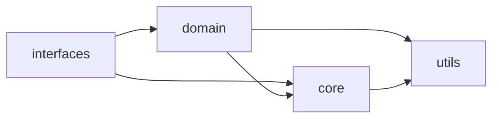

# app

Codigo-fonte principal do XFakeSong.

## Responsabilidade

Esta pasta contem as camadas executaveis da aplicacao: nucleo transversal,
dominio, adaptadores de entrada, utilitarios compartilhados e artefatos de
modelo usados pela inferencia.

## Quando usar

Use esta arvore para evoluir regras de negocio, pipelines de inferencia,
treinamento, extracao de features, UI Gradio, API FastAPI e CLI. Resultados de
benchmark e datasets grandes devem permanecer em `data/results/` e `data/` sempre
que nao forem artefatos de inferencia carregados pela aplicacao.

## Dependencias internas

## Pastas

- `core/`: configuracao, contratos, seguranca, middleware, DB e infraestrutura transversal.
- `domain/`: regras de negocio, modelos, features, servicos e XAI.
- `interfaces/`: adaptadores de entrada Gradio, FastAPI e CLI.
- `utils/`: utilitarios puros e compartilhados.
- `models/`: artefatos carregaveis de inferencia e manifesto dos modelos.

## Regras

- `domain/` nao deve importar `interfaces/`.
- Imports legados de `app.core.interfaces` sao mantidos por compatibilidade, mas codigo novo deve usar `app.core.contracts`.
- Novas capacidades devem nascer no dominio ou em um adaptador explicito, nao como utilitario global por conveniencia.
