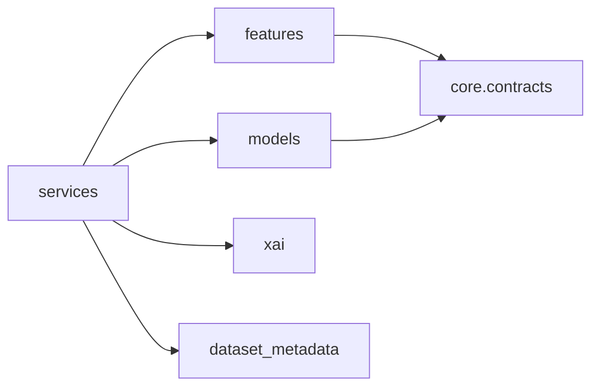

# domain

Camada de dominio do XFakeSong.

## Responsabilidade

Concentra regras de negocio e conhecimento do problema: deteccao de deepfake de
audio, treinamento, inferencia, extracao de features, metadados de datasets,
perfis de voz e explicabilidade.

## Quando usar

Use para implementar comportamento que deve sobreviver a troca de interface
Gradio/FastAPI/CLI. O dominio pode depender de contratos em `app.core.contracts`
e de utilitarios puros, mas nao deve depender de `app.interfaces`.

## Modulos

- `services/`: casos de uso e orquestracao de dominio.
- `models/`: entidades persistidas, arquiteturas, treino e inferencia.
- `features/`: extratores, adapters, registry e modelos de features.
- `dataset_metadata/`: catalogo e manifestos de datasets/falantes.
- `xai/`: explicabilidade e contratos tabulares.

## Fluxo interno

