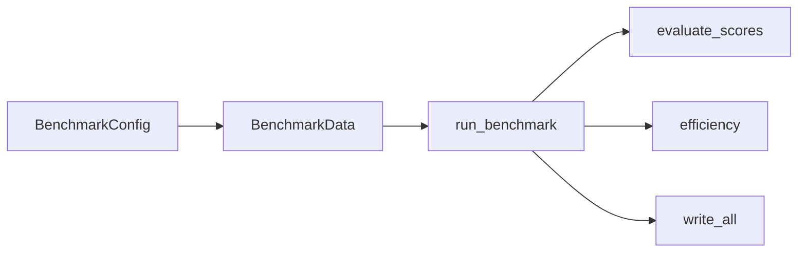

# benchmarks

Harness de benchmark e avaliacao experimental do XFakeSong.

## Responsabilidade

Orquestra execucoes reprodutiveis de treino, avaliacao, robustez, eficiencia e
geracao de relatorios para o recorte experimental do TCC.

## Quando usar

Use quando precisar executar ou planejar benchmarks por arquitetura, gerar
artefatos em `data/results/`, validar robustez com AWGN ou produzir tabelas/figuras
para documentacao cientifica.

## Dependencias

- `app.domain.models.architectures` para construir modelos.
- `app.domain.features.benchmark_frontend` para manter paridade treino/inferencia.
- `sklearn`, `numpy`, `matplotlib` e, para modelos neurais, TensorFlow/Keras.

## Arquivos

- `__init__.py`: API publica do pacote (`BenchmarkConfig`, `run_benchmark`,
  `plan_benchmark` e constantes oficiais).
- `config.py`: presets, manifesto oficial do TCC e listas de arquiteturas.
- `data.py`: carregamento, validacao, split e preparo de dados.
- `evaluate.py`: metricas de deteccao, incluindo AUC, EER e min-tDCF.
- `efficiency.py`: parametros, tamanho em disco e latencia.
- `planning.py`: plano de execucao e hiperparametros por arquitetura.
- `runner.py`: orquestracao ponta a ponta do benchmark.
- `report.py`: artefatos JSON/CSV/Markdown/LaTeX/figuras.
- `api_probe.py`: verificacao de endpoints da API durante benchmarks.

## Fluxo interno

## Nota arquitetural

Este pacote foi restaurado por compatibilidade porque scripts, testes e
notebooks importam `benchmarks.*` diretamente. A evolucao recomendada e manter a
API estavel enquanto se decide se o harness permanece como pacote de
experimentos ou migra para um modulo dedicado de avaliacao.

## Protocolo AWGN para o retreino

O benchmark comparável aplica AWGN na forma de onda, depois do split e antes do
frontend de cada arquitetura. O modo estrito rejeita datasets reais que
contenham somente features. O comando canônico e a lista de verificações estão
em docs/evaluation/retraining-adjustments.md.