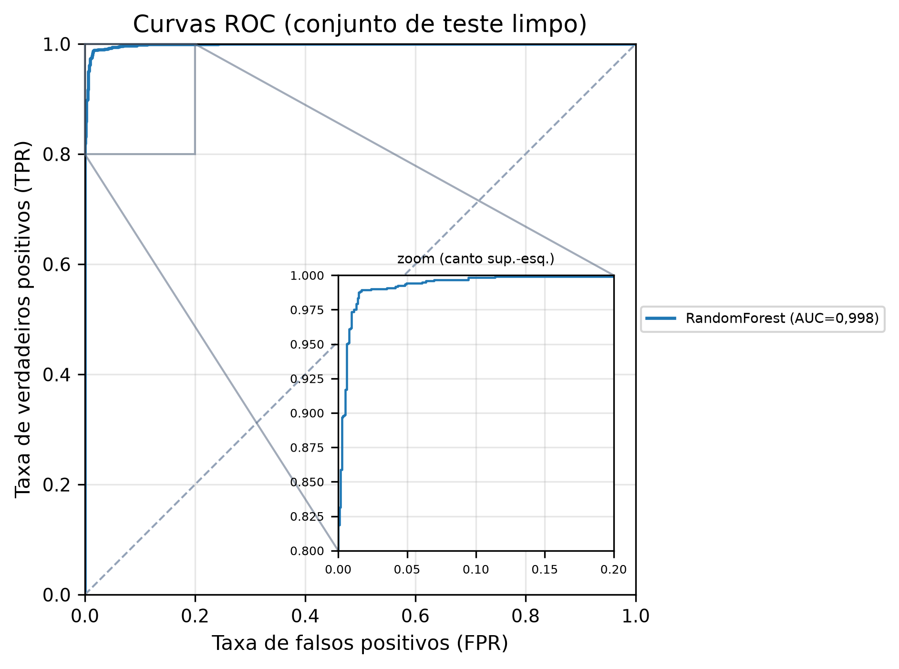
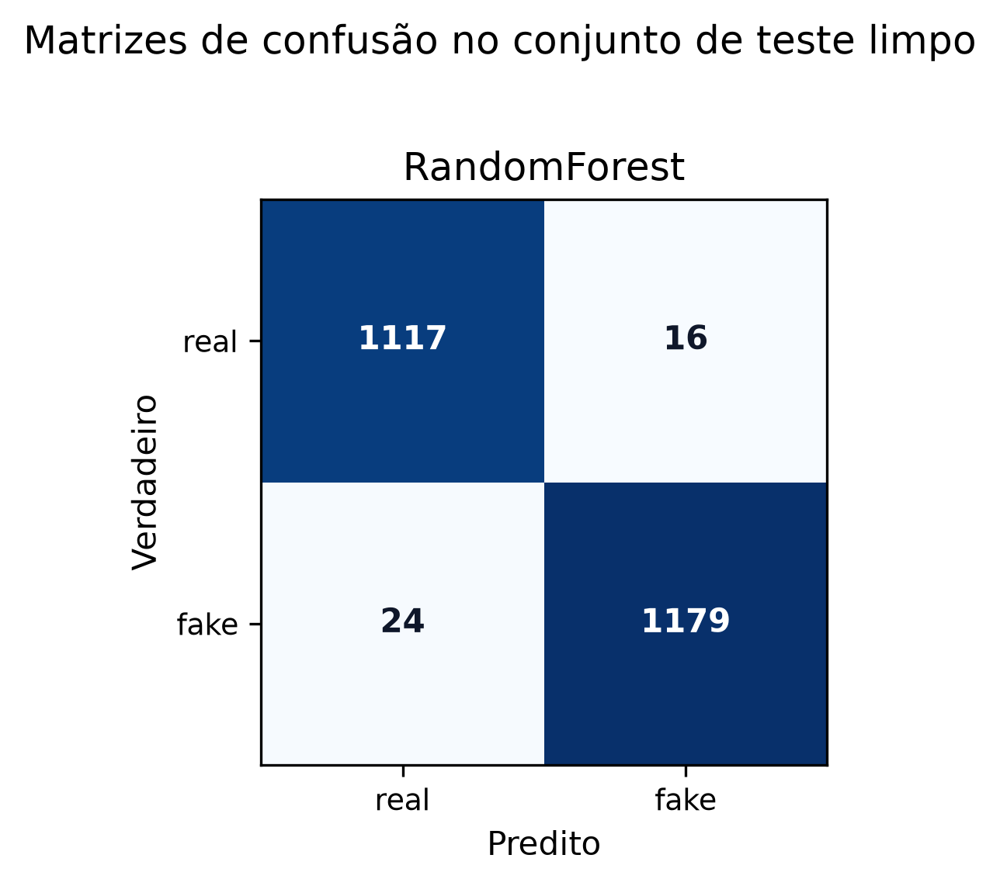
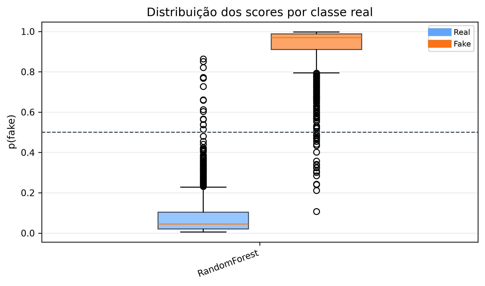
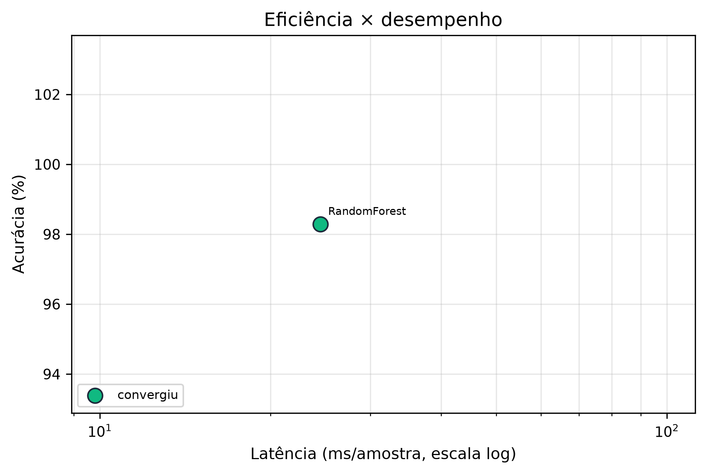
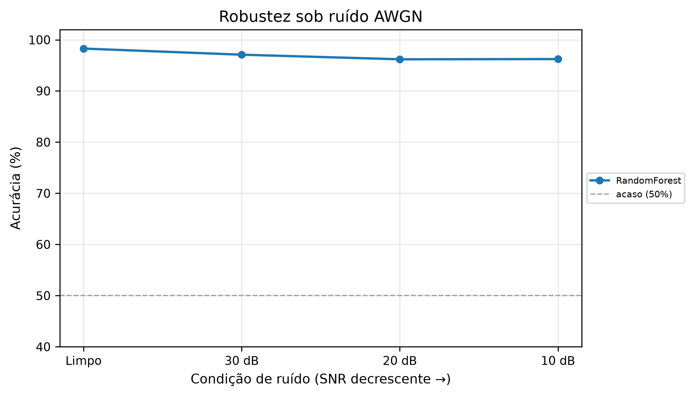
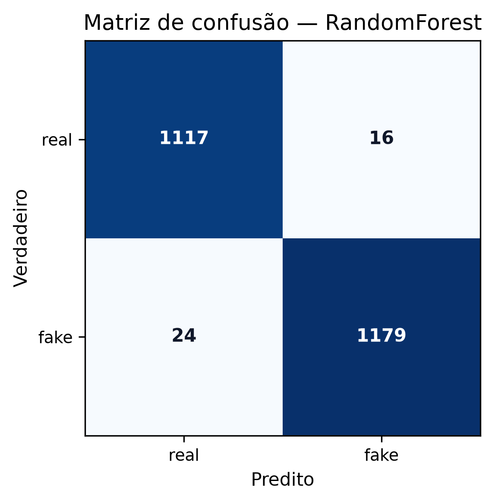
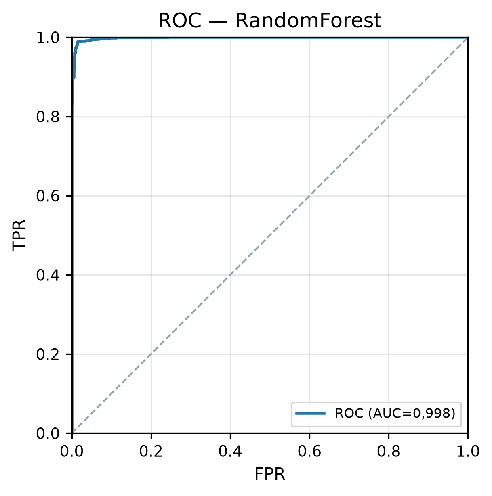
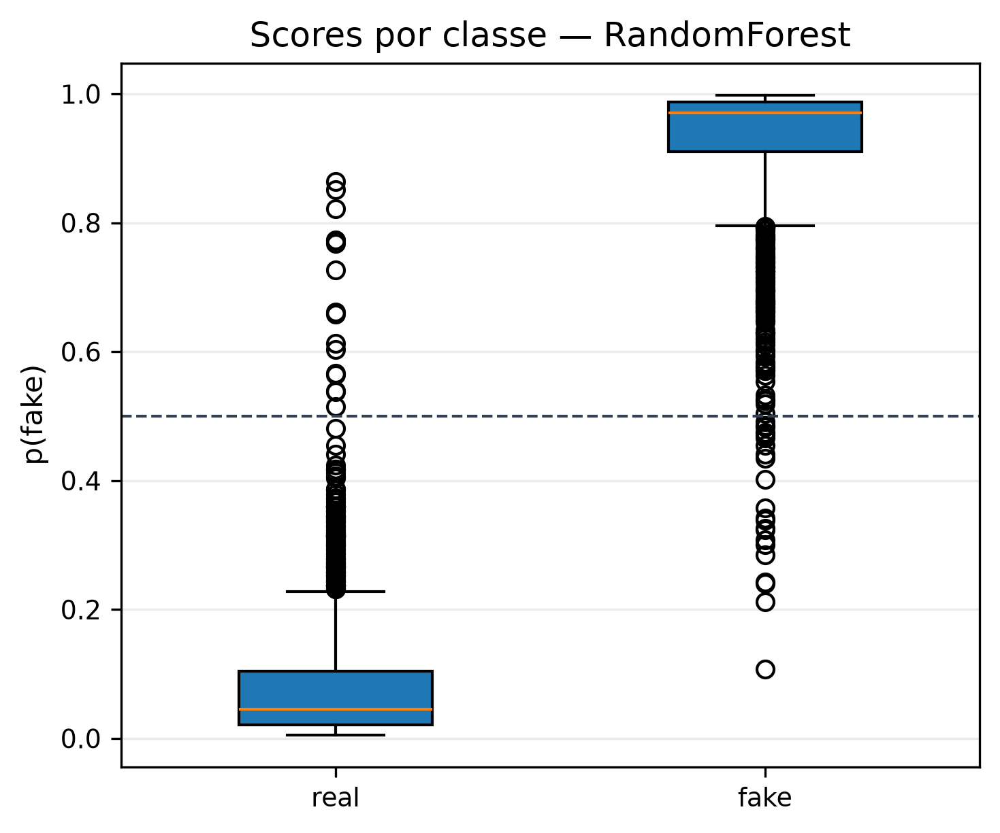
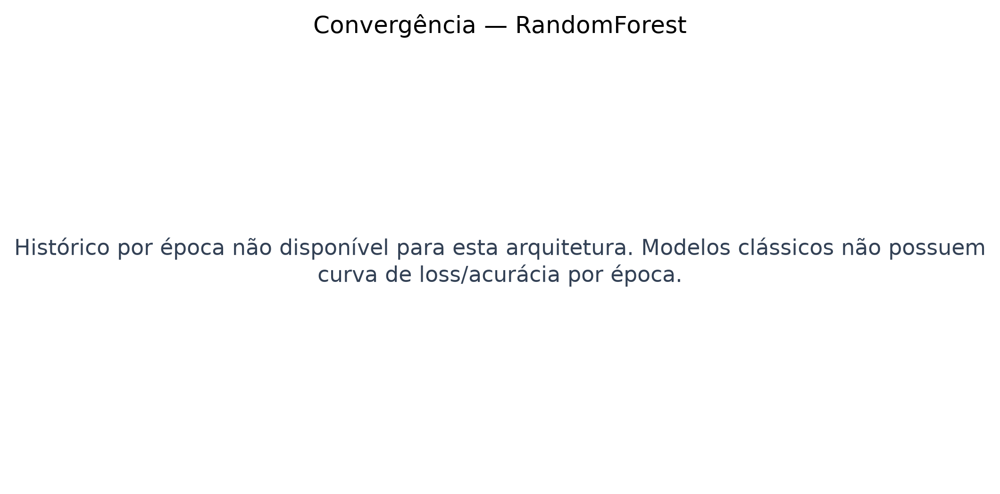

# Relatório de Benchmark para TCC - XFakeSong

## 1. Dataset

- Nome: `benchmark_audio_raw_balanced_15k_academic_v2`
- Total de amostras exportadas: `15572`
- Amostras no teste held-out: `2336`
- Shape de entrada bruto: `[80000, 1]`
- Balanceamento no teste: `{'real': 1133, 'fake': 1203}`
- Caminho de origem: `data/datasets/splits`

## 2. Ambiente de Execução

- Plataforma: `Linux 6.18.33.2-microsoft-standard-WSL2`
- Python: `3.11.15`
- TensorFlow: `2.21.0`
- GPU ativa: `True`
- Dispositivo: `✓ NVIDIA GeForce RTX 3060 · CC 8.6 · Tensor Cores · FP16`

## 3. Configuração Global do Benchmark

- Arquiteturas: `RandomForest`
- Épocas por arquitetura neural: `100`
- Batch size: `32`
- Semente: `42`
- Testes de robustez SNR: `[30, 20, 10]`
- Medições de latência por arquitetura: `30`
- API probe: `False`

## 4. Resultados Numéricos

| Arquitetura | Status | Acurácia | AUC-ROC | EER | min-tDCF | Latência ms | Params |
|---|---:|---:|---:|---:|---:|---:|---:|
| RandomForest | ok | 0,9829 | 0,9983 | 0,0158 | 0,0404 | 24,49 | None |

## 5. Gráficos Agregados












## 6. Hiperparâmetros e Artefatos por Arquitetura

### RandomForest

- Status: `ok`
- Tipo: `classical`
- Shape preparado: `[63]`
- Treino executado: `CV 72+fit`
- Tempo total: `912.4` s
- Artefato do modelo: `/app/data/models/bench_randomforest.pkl`

Hiperparâmetros/configuração de treino:

```json
{
  "model_family": "classical",
  "batch_size": null,
  "epochs": null,
  "fit_strategy": {
    "kind": "grid_search_cv_then_refit",
    "estimator": "sklearn",
    "fit_samples": 24135,
    "n_features": 63,
    "cv": 3,
    "n_candidates": 24,
    "n_fits": 72,
    "final_refit": true,
    "scoring": "roc_auc",
    "total_fit_calls_estimate": 73
  },
  "fit_samples": 24135,
  "n_features": 63,
  "hyperparameter_tuning": {
    "enabled": true,
    "method": "GridSearchCV",
    "scoring": "roc_auc",
    "cv": 3,
    "param_grid": {
      "rf__n_estimators": [
        100,
        200
      ],
      "rf__max_depth": [
        null,
        10,
        20
      ],
      "rf__min_samples_leaf": [
        1,
        2
      ],
      "rf__max_features": [
        "sqrt",
        "log2"
      ]
    },
    "n_candidates": 24,
    "status": "ok",
    "elapsed_s": 30.566,
    "best_score": 0.9938776253711495,
    "best_params": {
      "rf__max_depth": 10,
      "rf__max_features": "log2",
      "rf__min_samples_leaf": 2,
      "rf__n_estimators": 100
    },
    "best_model_params": {
      "max_depth": 10,
      "max_features": "log2",
      "min_samples_leaf": 2,
      "n_estimators": 100
    },
    "top_candidates": [
      {
        "rank": 1,
        "mean_test_score": 0.9938776253711495,
        "std_test_score": 0.007630895305871316,
        "mean_train_score": 0.9999897788383497,
        "params_json": "{\"rf__max_depth\": 10, \"rf__max_features\": \"log2\", \"rf__min_samples_leaf\": 2, \"rf__n_estimators\": 100}"
      },
      {
        "rank": 2,
        "mean_test_score": 0.9938476702835412,
        "std_test_score": 0.007865712380302554,
        "mean_train_score": 0.9999935738241111,
        "params_json": "{\"rf__max_depth\": 10, \"rf__max_features\": \"log2\", \"rf__min_samples_leaf\": 2, \"rf__n_estimators\": 200}"
      },
      {
        "rank": 3,
        "mean_test_score": 0.9932505419239667,
        "std_test_score": 0.00878843707294927,
        "mean_train_score": 1.0,
        "params_json": "{\"rf__max_depth\": 20, \"rf__max_features\": \"log2\", \"rf__min_samples_leaf\": 2, \"rf__n_estimators\": 200}"
      },
      {
        "rank": 4,
        "mean_test_score": 0.9932502383251057,
        "std_test_score": 0.008788437072949322,
        "mean_train_score": 1.0,
        "params_json": "{\"rf__max_depth\": null, \"rf__max_features\": \"log2\", \"rf__min_samples_leaf\": 2, \"rf__n_estimators\": 200}"
      },
      {
        "rank": 5,
        "mean_test_score": 0.9931981711204619,
        "std_test_score": 0.008620358024462905,
        "mean_train_score": 0.9999967110123403,
        "params_json": "{\"rf__max_depth\": 10, \"rf__max_features\": \"log2\", \"rf__min_samples_leaf\": 1, \"rf__n_estimators\": 100}"
      }
    ]
  },
  "best_hyperparameters": {
    "max_depth": 10,
    "max_features": "log2",
    "min_samples_leaf": 2,
    "n_estimators": 100
  },
  "waveform_noise_protocol": {
    "evaluation_domain": "waveform",
    "frontend_after_noise": true,
    "training_augmentation_domain": "waveform",
    "train_aug_snr_db": [
      30,
      20,
      10
    ],
    "train_noise_copies": 1,
    "waveform_noise_batch_size": 64,
    "assigned_snr_counts": {
      "10": 3633,
      "20": 3633,
      "30": 3633
    },
    "clean_train_samples": 10899,
    "fit_train_samples": 21798,
    "input_type": "tabular_audio_features",
    "original_shape": [
      80000,
      1
    ],
    "prepared_shape": [
      63
    ],
    "train_crop_strategy": null,
    "eval_crop_strategy": null,
    "eval_num_crops": 1
  }
}
```









- Métricas completas: `architectures/randomforest/metrics.json`
- Predições limpas: `architectures/randomforest/predictions_clean.csv`
- Predições sob ruído: `architectures/randomforest/predictions_robustness.csv`
- Robustez: `architectures/randomforest/robustness.csv`
