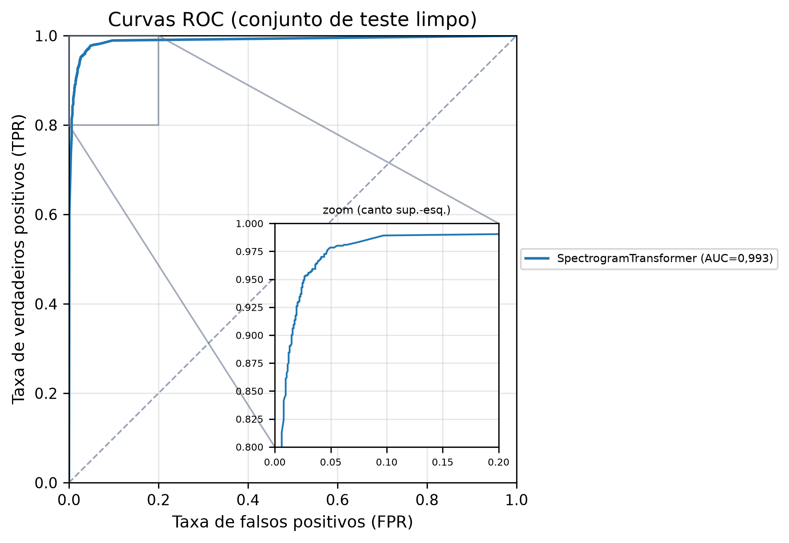
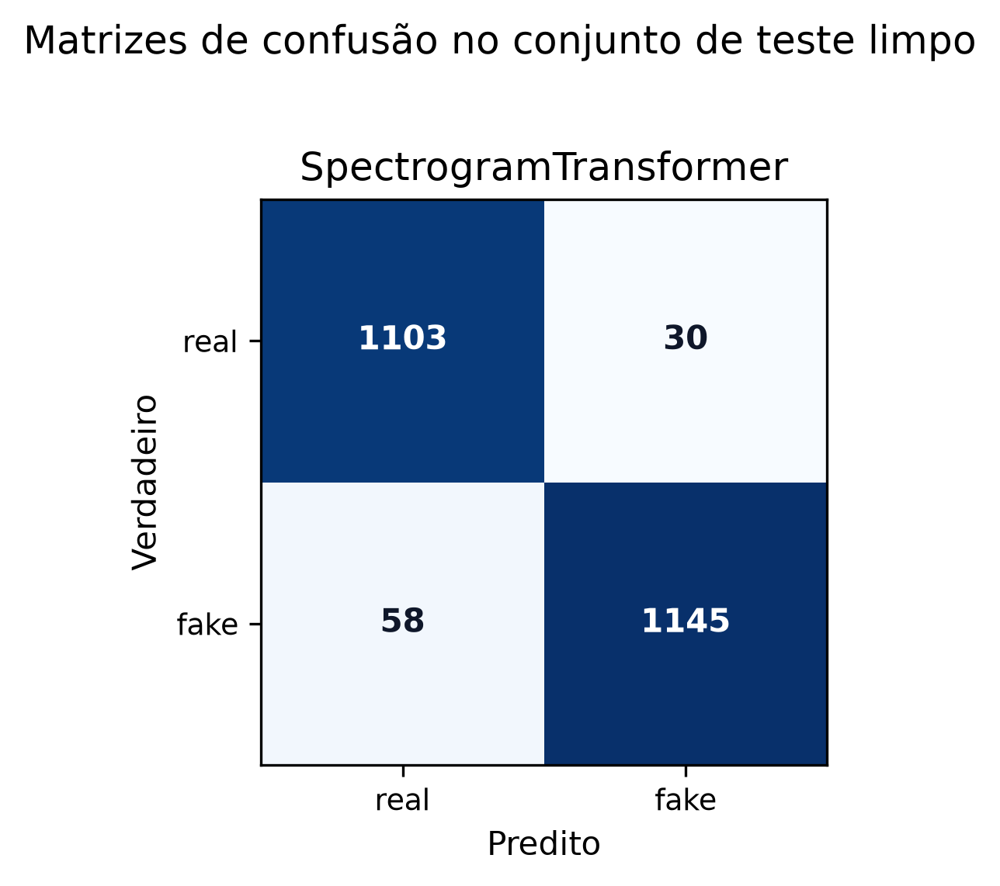
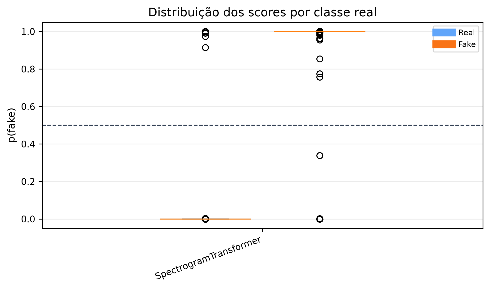
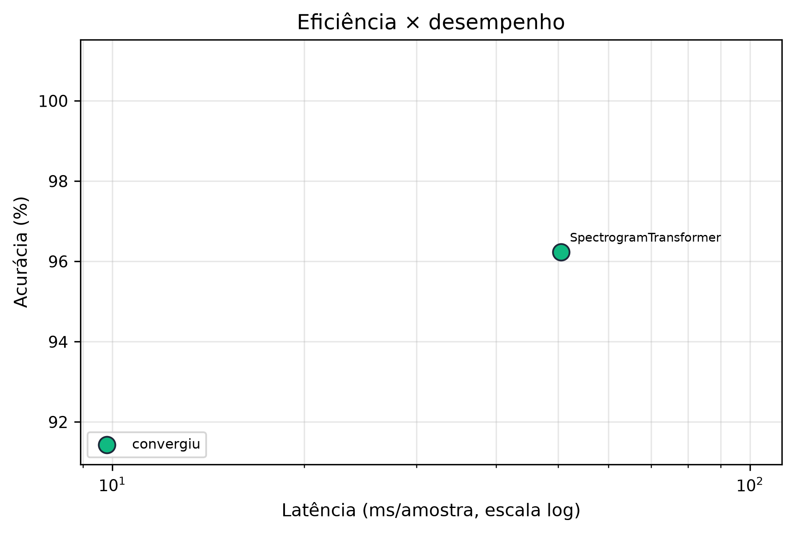
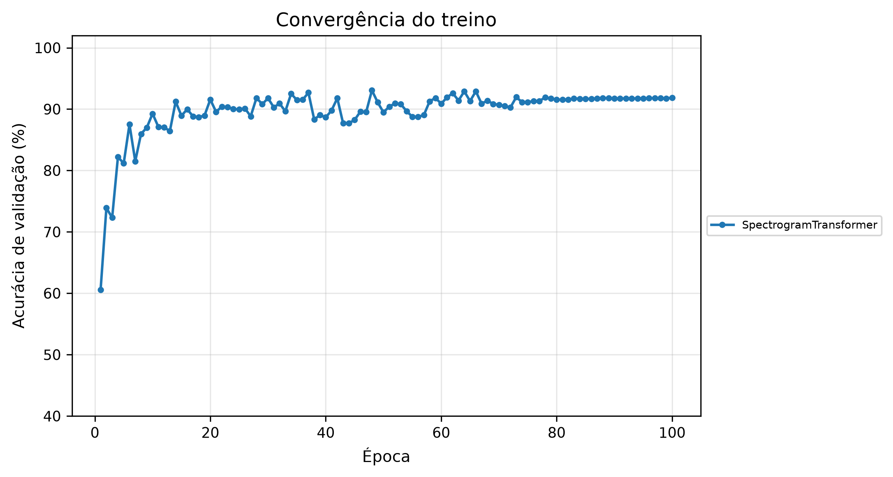
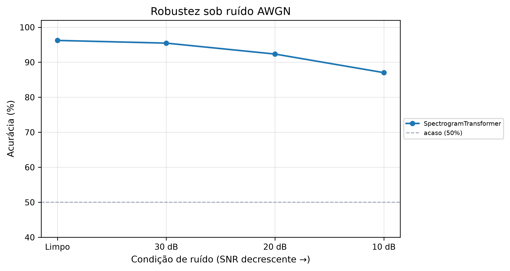
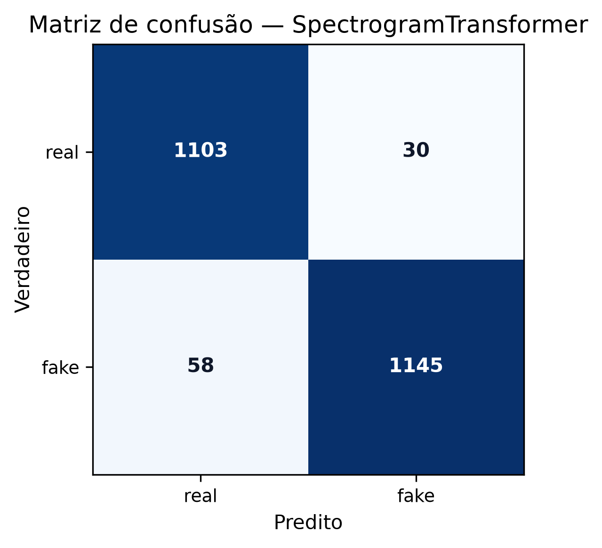
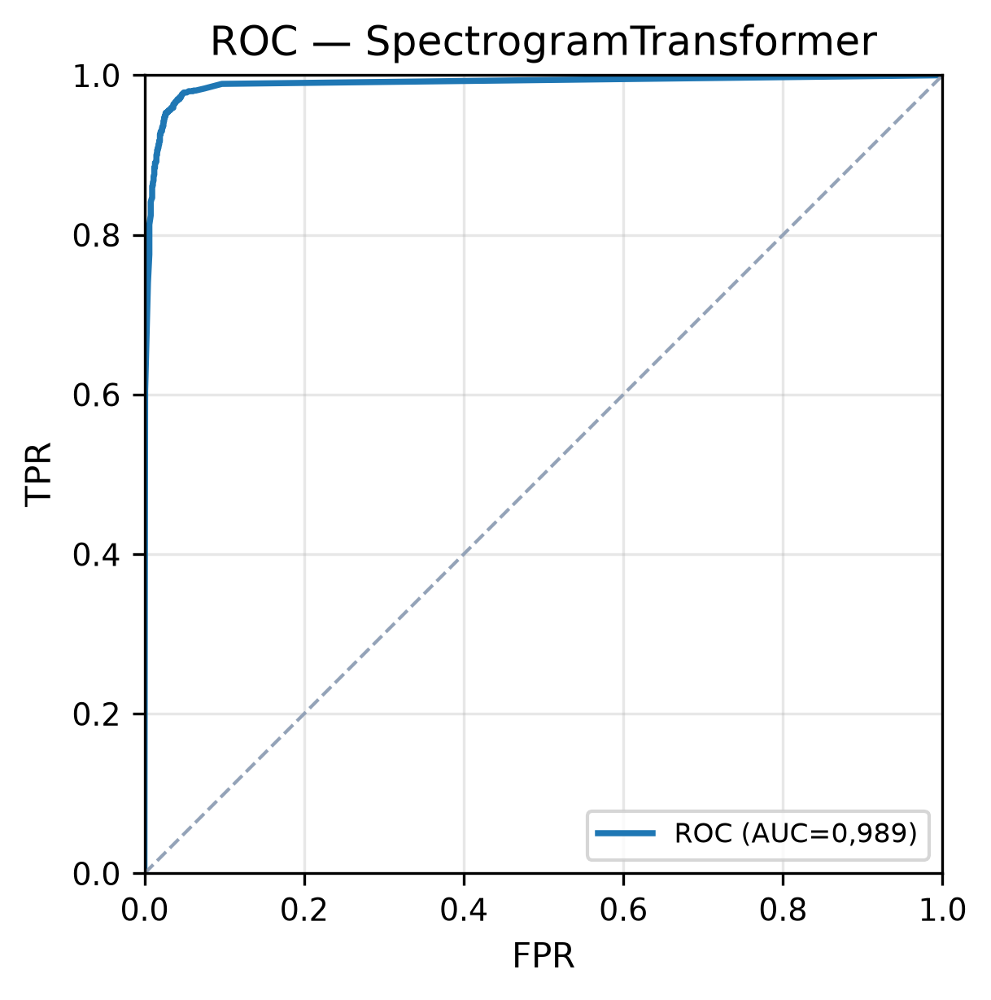
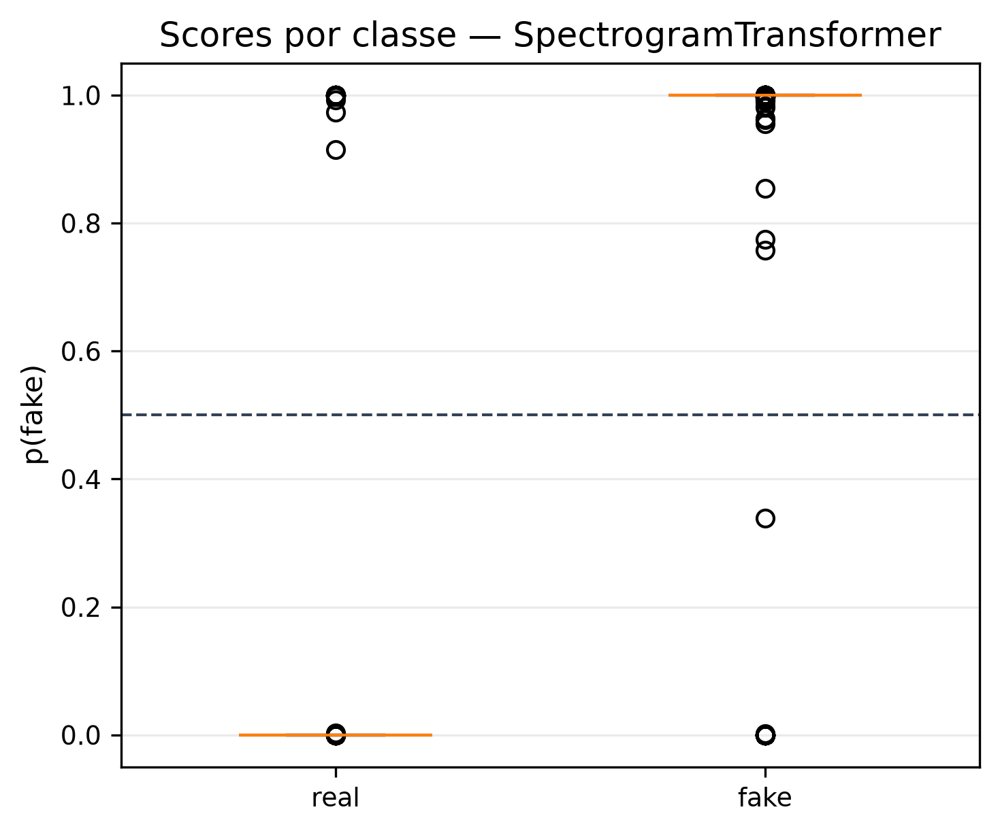
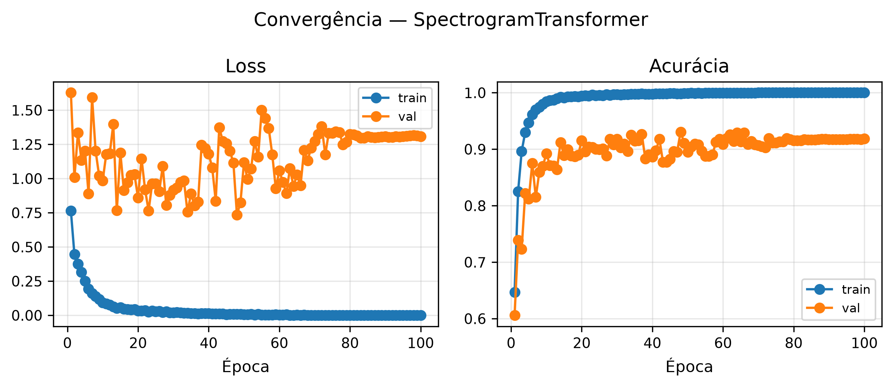

# Relatório de Benchmark para TCC - XFakeSong

## 1. Dataset

- Nome: `benchmark_audio_raw_balanced_15k_academic_v2`
- Total de amostras exportadas: `15572`
- Amostras no teste held-out: `2336`
- Shape de entrada bruto: `[80000, 1]`
- Balanceamento no teste: `{'real': 1133, 'fake': 1203}`
- Caminho de origem: `data/datasets/splits`

## 2. Ambiente de Execução

- Plataforma: `Linux 6.18.33.2-microsoft-standard-WSL2`
- Python: `3.11.15`
- TensorFlow: `2.21.0`
- GPU ativa: `True`
- Dispositivo: `✓ NVIDIA GeForce RTX 3060 · CC 8.6 · Tensor Cores · FP16`

## 3. Configuração Global do Benchmark

- Arquiteturas: `SpectrogramTransformer`
- Épocas por arquitetura neural: `100`
- Batch size: `32`
- Semente: `42`
- Testes de robustez SNR: `[30, 20, 10]`
- Medições de latência por arquitetura: `30`
- API probe: `False`

## 4. Resultados Numéricos

| Arquitetura | Status | Acurácia | AUC-ROC | EER | min-tDCF | Latência ms | Params |
|---|---:|---:|---:|---:|---:|---:|---:|
| SpectrogramTransformer | ok | 0,9623 | 0,9933 | 0,0364 | 0,0967 | 50,58 | 85304834 |

## 5. Gráficos Agregados













## 6. Hiperparâmetros e Artefatos por Arquitetura

### SpectrogramTransformer

- Status: `ok`
- Tipo: `neural`
- Shape preparado: `[100, 80]`
- Treino executado: `100`
- Tempo total: `11591.0` s
- Artefato do modelo: `/app/data/models/bench_spectrogramtransformer.keras`

Hiperparâmetros/configuração de treino:

```json
{
  "batch_size": 8,
  "epochs": 100,
  "learning_rate": 1e-05,
  "lr_is_explicit": false,
  "verbose": 0,
  "progress_log_interval": 1,
  "progress_label": "SpectrogramTransformer",
  "validation_split": 0.2,
  "test_split": 0.1,
  "early_stopping": false,
  "early_stopping_patience": 20,
  "reduce_lr_on_plateau": false,
  "reduce_lr_patience": 12,
  "available_architectures": [
    "aasist",
    "conformer",
    "efficientnet_lstm",
    "ensemble",
    "multiscale_cnn",
    "rawgat_st",
    "spectrogram_transformer"
  ],
  "optimizer": "AdamW",
  "loss_function": "binary_crossentropy",
  "metrics": [
    "accuracy",
    "precision",
    "recall",
    "f1"
  ],
  "use_augmentation": false,
  "augmentation_config": {
    "noise_factor": 0.1,
    "snr_range_db": [
      5.0,
      40.0
    ],
    "time_stretch_factor": 0.1,
    "pitch_shift_steps": 2
  },
  "use_class_weighting": true,
  "auto_calibrate_temperature": true,
  "calibration_min_samples": 50,
  "calibrate_under_noise": false,
  "calibration_snr_db": [
    20,
    10
  ],
  "use_swa": false,
  "swa_start_epoch": -1,
  "swa_freq": 1,
  "use_mixup": false,
  "mixup_alpha": 0.2,
  "compute_ood_threshold": true,
  "ood_quantile": 0.95,
  "export_onnx": false,
  "export_onnx_int8": false,
  "use_mixed_precision": true,
  "checkpoint_path": "/app/data/results/benchmark_academic_v2/spectrogramtransformer/architectures/spectrogramtransformer/models/best_checkpoint.weights.h5",
  "checkpoint_best": true,
  "best_checkpoint_path": "/app/data/results/benchmark_academic_v2/spectrogramtransformer/architectures/spectrogramtransformer/models/best_checkpoint.weights.h5",
  "model_parameters": {
    "learning_rate": 1e-05,
    "weight_decay": 1e-05,
    "warmup_steps": 3000,
    "decay_steps": 262500,
    "alpha": 1e-06,
    "dropout_rate": 0.25
  },
  "waveform_noise_protocol": {
    "evaluation_domain": "waveform",
    "frontend_after_noise": true,
    "training_augmentation_domain": "waveform",
    "train_aug_snr_db": [
      30,
      20,
      10
    ],
    "train_noise_copies": 1,
    "waveform_noise_batch_size": 64,
    "assigned_snr_counts": {
      "10": 3633,
      "20": 3633,
      "30": 3633
    },
    "clean_train_samples": 10899,
    "fit_train_samples": 21798,
    "input_type": "spectrogram",
    "original_shape": [
      80000,
      1
    ],
    "prepared_shape": [
      100,
      80
    ],
    "train_crop_strategy": null,
    "eval_crop_strategy": null,
    "eval_num_crops": 1
  },
  "epochs_budget": 100,
  "epochs_executed": 100
}
```









- Métricas completas: `architectures/spectrogramtransformer/metrics.json`
- Predições limpas: `architectures/spectrogramtransformer/predictions_clean.csv`
- Predições sob ruído: `architectures/spectrogramtransformer/predictions_robustness.csv`
- Robustez: `architectures/spectrogramtransformer/robustness.csv`
