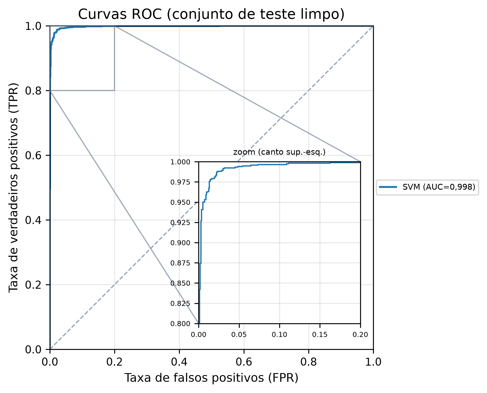
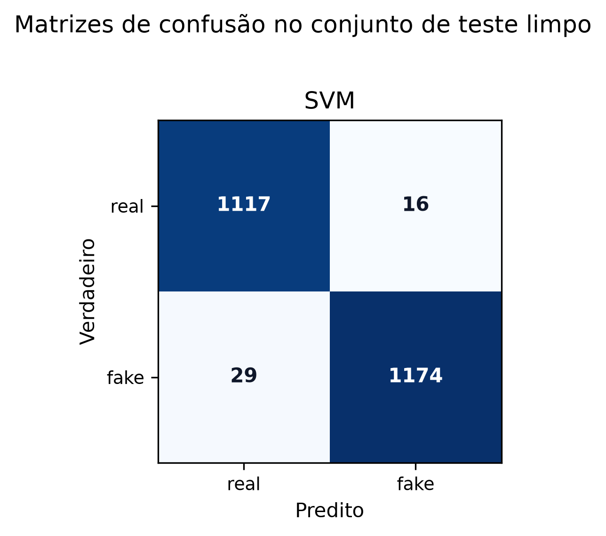
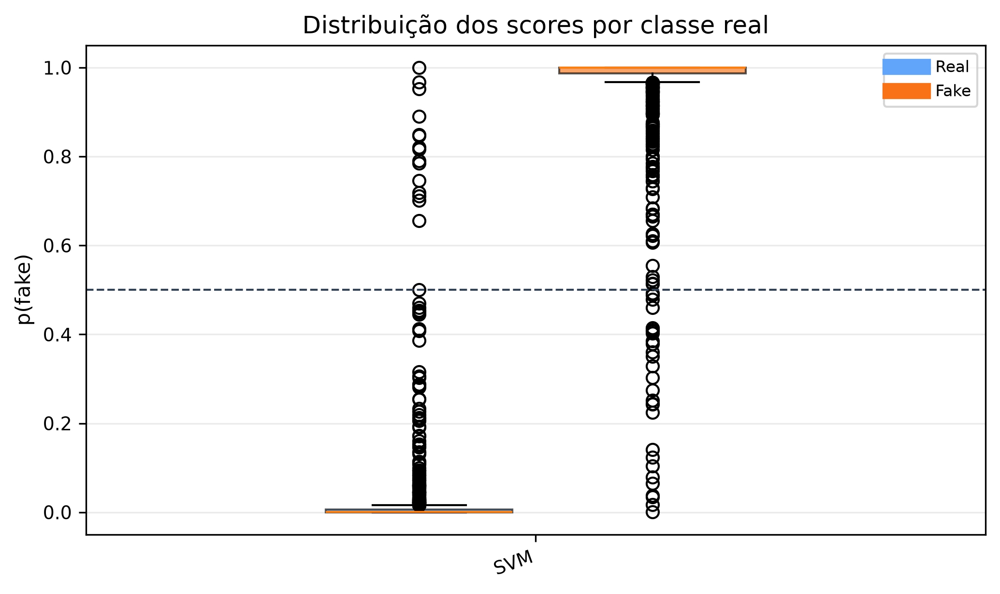
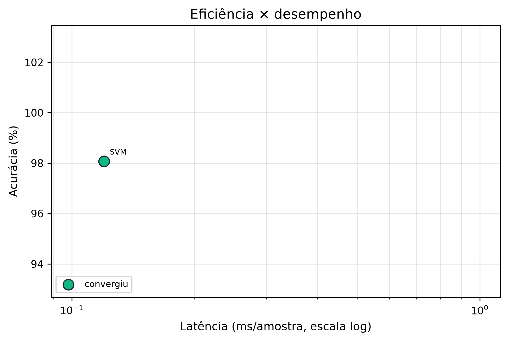
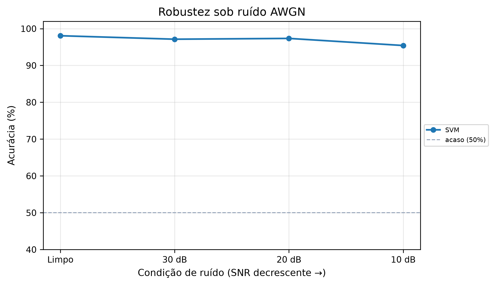
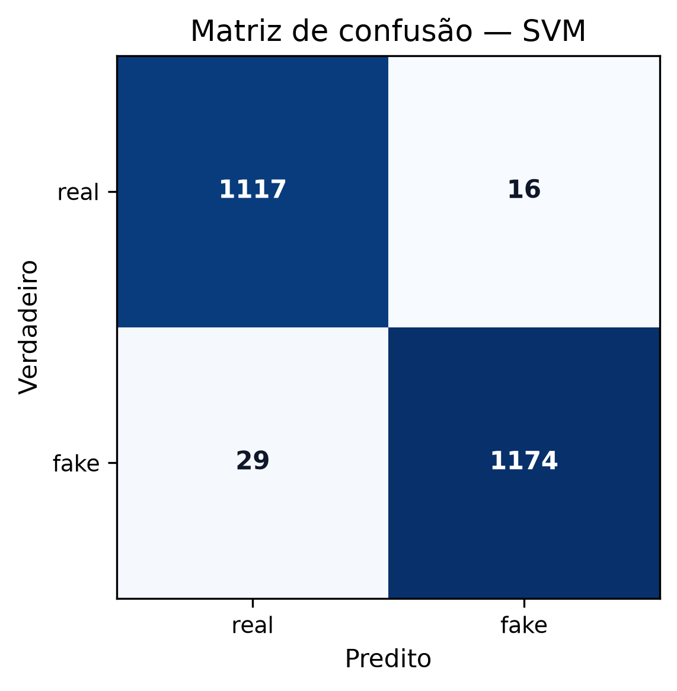
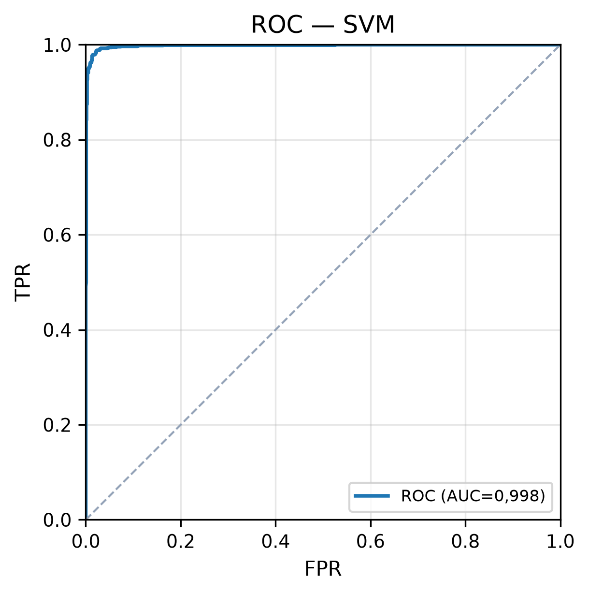
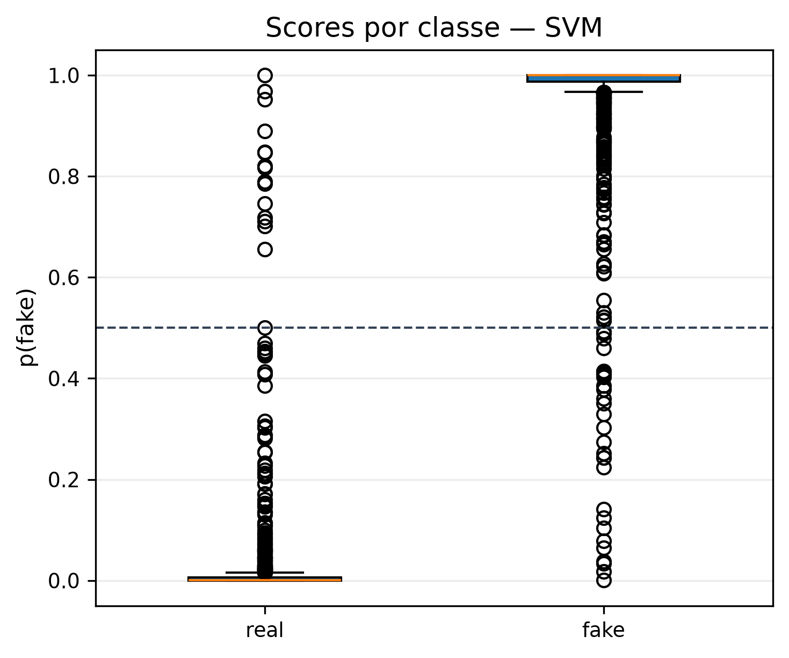
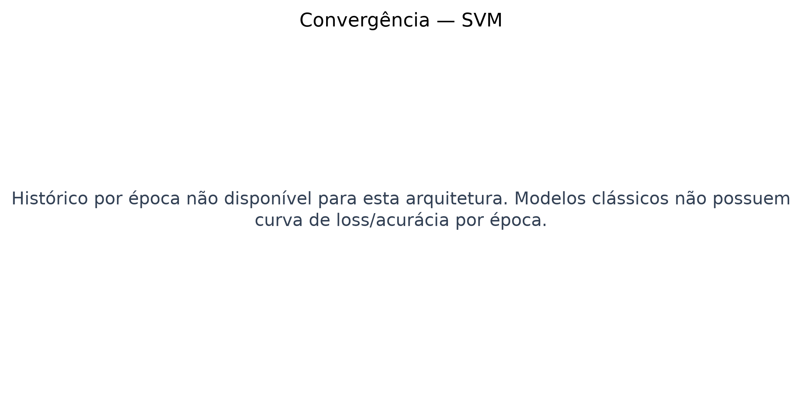

# Relatório de Benchmark para TCC - XFakeSong

## 1. Dataset

- Nome: `benchmark_audio_raw_balanced_15k_academic_v2`
- Total de amostras exportadas: `15572`
- Amostras no teste held-out: `2336`
- Shape de entrada bruto: `[80000, 1]`
- Balanceamento no teste: `{'real': 1133, 'fake': 1203}`
- Caminho de origem: `data/datasets/splits`

## 2. Ambiente de Execução

- Plataforma: `Linux 6.18.33.2-microsoft-standard-WSL2`
- Python: `3.11.15`
- TensorFlow: `2.21.0`
- GPU ativa: `True`
- Dispositivo: `✓ NVIDIA GeForce RTX 3060 · CC 8.6 · Tensor Cores · FP16`

## 3. Configuração Global do Benchmark

- Arquiteturas: `SVM`
- Épocas por arquitetura neural: `100`
- Batch size: `32`
- Semente: `42`
- Testes de robustez SNR: `[30, 20, 10]`
- Medições de latência por arquitetura: `30`
- API probe: `False`

## 4. Resultados Numéricos

| Arquitetura | Status | Acurácia | AUC-ROC | EER | min-tDCF | Latência ms | Params |
|---|---:|---:|---:|---:|---:|---:|---:|
| SVM | ok | 0,9807 | 0,9978 | 0,0193 | 0,0479 | 0,12 | None |

## 5. Gráficos Agregados












## 6. Hiperparâmetros e Artefatos por Arquitetura

### SVM

- Status: `ok`
- Tipo: `classical`
- Shape preparado: `[63]`
- Treino executado: `CV 36+fit`
- Tempo total: `930.0` s
- Artefato do modelo: `/app/data/models/bench_svm.pkl`

Hiperparâmetros/configuração de treino:

```json
{
  "model_family": "classical",
  "batch_size": null,
  "epochs": null,
  "fit_strategy": {
    "kind": "grid_search_cv_then_refit",
    "estimator": "sklearn",
    "fit_samples": 24135,
    "n_features": 63,
    "cv": 3,
    "n_candidates": 12,
    "n_fits": 36,
    "final_refit": true,
    "scoring": "roc_auc",
    "total_fit_calls_estimate": 37
  },
  "fit_samples": 24135,
  "n_features": 63,
  "hyperparameter_tuning": {
    "enabled": true,
    "method": "GridSearchCV",
    "scoring": "roc_auc",
    "cv": 3,
    "param_grid": {
      "svm__kernel": [
        "linear",
        "rbf"
      ],
      "svm__C": [
        0.1,
        1.0,
        10.0
      ],
      "svm__gamma": [
        "scale",
        "auto"
      ]
    },
    "n_candidates": 12,
    "status": "ok",
    "elapsed_s": 14.626,
    "best_score": 0.9956717934394309,
    "best_params": {
      "svm__C": 10.0,
      "svm__gamma": "scale",
      "svm__kernel": "linear"
    },
    "best_model_params": {
      "C": 10.0,
      "gamma": "scale",
      "kernel": "linear"
    },
    "top_candidates": [
      {
        "rank": 1,
        "mean_test_score": 0.9956717934394309,
        "std_test_score": 0.004821286957685148,
        "mean_train_score": 0.9991953618190025,
        "params_json": "{\"svm__C\": 10.0, \"svm__gamma\": \"scale\", \"svm__kernel\": \"linear\"}"
      },
      {
        "rank": 1,
        "mean_test_score": 0.9956717934394309,
        "std_test_score": 0.004821286957685148,
        "mean_train_score": 0.9991953618190025,
        "params_json": "{\"svm__C\": 10.0, \"svm__gamma\": \"auto\", \"svm__kernel\": \"linear\"}"
      },
      {
        "rank": 3,
        "mean_test_score": 0.9953162791733204,
        "std_test_score": 0.005214964340861398,
        "mean_train_score": 0.9990376928105765,
        "params_json": "{\"svm__C\": 0.1, \"svm__gamma\": \"scale\", \"svm__kernel\": \"linear\"}"
      },
      {
        "rank": 3,
        "mean_test_score": 0.9953162791733204,
        "std_test_score": 0.005214964340861398,
        "mean_train_score": 0.9990376928105765,
        "params_json": "{\"svm__C\": 0.1, \"svm__gamma\": \"auto\", \"svm__kernel\": \"linear\"}"
      },
      {
        "rank": 5,
        "mean_test_score": 0.9952490826254419,
        "std_test_score": 0.00531309416174464,
        "mean_train_score": 0.9991368431385647,
        "params_json": "{\"svm__C\": 1.0, \"svm__gamma\": \"scale\", \"svm__kernel\": \"linear\"}"
      }
    ]
  },
  "best_hyperparameters": {
    "C": 10.0,
    "gamma": "scale",
    "kernel": "linear"
  },
  "waveform_noise_protocol": {
    "evaluation_domain": "waveform",
    "frontend_after_noise": true,
    "training_augmentation_domain": "waveform",
    "train_aug_snr_db": [
      30,
      20,
      10
    ],
    "train_noise_copies": 1,
    "waveform_noise_batch_size": 64,
    "assigned_snr_counts": {
      "10": 3633,
      "20": 3633,
      "30": 3633
    },
    "clean_train_samples": 10899,
    "fit_train_samples": 21798,
    "input_type": "tabular_audio_features",
    "original_shape": [
      80000,
      1
    ],
    "prepared_shape": [
      63
    ],
    "train_crop_strategy": null,
    "eval_crop_strategy": null,
    "eval_num_crops": 1
  }
}
```









- Métricas completas: `architectures/svm/metrics.json`
- Predições limpas: `architectures/svm/predictions_clean.csv`
- Predições sob ruído: `architectures/svm/predictions_robustness.csv`
- Robustez: `architectures/svm/robustness.csv`
