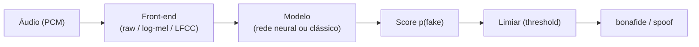

# Conceitos e Fundamentos

Esta página dá o **contexto teórico** mínimo para entender o que o XFakeSong
faz e por quê. É leitura recomendada antes da [Introdução](01_INTRODUCAO.md)
para quem não conhece a área de *anti-spoofing* de áudio. Termos pontuais estão
no [Glossário](18_GLOSSARIO.md).

## O problema: deepfakes de áudio

Um **deepfake de áudio** é um sinal de voz **sintético ou manipulado** criado
para soar como uma pessoa real. Com modelos generativos modernos, gerar uma voz
convincente ficou barato e acessível — o que abre espaço para fraude por voz,
desinformação e burla de sistemas de **verificação automática de locutor**
(ASV, *Automatic Speaker Verification*).

A contramedida é o **anti-spoofing** (também chamado de *spoofing
countermeasure*, CM): um classificador que decide se um áudio é **bonafide**
(voz humana genuína) ou **spoof** (falsificado). É exatamente a tarefa que o
XFakeSong implementa e compara entre arquiteturas.

!!! info "Bonafide × Spoof"
    A convenção da área (e do projeto) é binária: a classe positiva de interesse
    é o **spoof** (fake). A saída de 1 unidade sigmoide dos modelos representa
    `p(fake)` — a probabilidade de o áudio ser falsificado.

## Modelo de ameaça (tipos de ataque)

A literatura (sobretudo a série **ASVspoof**) agrupa os ataques em três famílias:

| Família | Como é gerado | Exemplos |
| --- | --- | --- |
| **TTS** (*Text-to-Speech*) | Sintetiza fala a partir de texto | Tacotron, FastSpeech, VITS |
| **VC** (*Voice Conversion*) | Converte a voz A na voz B | CycleGAN-VC, AutoVC |
| **Replay** | Regrava e reproduz um áudio real | Gravação + alto-falante |

TTS e VC produzem ataques **lógicos** (*Logical Access*, LA); replay produz
ataques **físicos** (*Physical Access*, PA). O desafio central é **generalizar
para ataques não vistos** no treino — um detector que decora os ataques
conhecidos costuma falhar contra um gerador novo.

## Como a detecção funciona

O fluxo conceitual é o mesmo para quase todas as arquiteturas:

1. **Front-end** — transforma a forma de onda numa representação que o modelo
   consome. Duas grandes escolhas:
    - **raw-audio**: o modelo recebe o PCM 1D e aprende os filtros (ex.: SincNet);
    - **espectrograma**: log-mel ou **LFCC** calculados com a STFT.
2. **Modelo** — extrai padrões discriminativos e produz um *score*.
3. **Limiar** — converte o *score* contínuo em decisão. O limiar é **calibrado**
   (no XFakeSong, pelo **EER** no conjunto de validação), não fixado em 0,5.

!!! tip "Paridade treino↔inferência"
    O detalhe que mais quebra detectores na prática é usar um front-end no treino
    e outro na inferência. O XFakeSong grava um **`input_contract`** (front-end,
    `n_fft`/`hop`/`n_mels`, *sample rate*, temperatura, EER) junto do modelo e o
    reaplica na inferência. Veja [Inferência](09_INFERENCIA.md).

## Famílias de arquiteturas

O projeto reúne **14 arquiteturas** comparáveis (ver
[Arquiteturas Neurais](08_ARQUITETURAS.md)):

- **Forma de onda + SincNet** — RawNet2: filtros passa-banda aprendidos direto no PCM.
- **Grafo espectro-temporal** — AASIST e RawGAT-ST: *graph attention* sobre nós
  espectrais e temporais; estado da arte em datasets controlados.
- **SSL (auto-supervisionado)** — WavLM e HuBERT: *backbones* pré-treinados em
  muita fala não rotulada, usados como extratores com *fine-tuning* parcial.
- **Espectrograma + Transformer/CNN** — Conformer, SpectrogramTransformer,
  Hybrid CNN-Transformer, EfficientNet-LSTM, MultiscaleCNN, Sonic Sleuth.
- **Fusão** — Ensemble: combina vários ramos para a decisão final.
- **Clássicos (baseline)** — SVM e Random Forest sobre features agregadas;
  leves, rodam em CPU e servem de referência honesta.

## Como medir (e por que acurácia não basta)

Detecção de spoof é um problema **desbalanceado e sensível ao custo do erro**.
Por isso a área usa métricas próprias (ver [Glossário](18_GLOSSARIO.md) e
[Benchmark](15_BENCHMARK.md)):

- **EER (Equal Error Rate)** — ponto em que falsos positivos e falsos negativos
  se igualam. **Menor é melhor.** É a métrica principal.
- **min-tDCF** — custo mínimo do sistema combinado ASV + detector (ASVspoof);
  pondera os dois tipos de erro segundo um cenário operacional.
- **AUC-ROC** — capacidade de ranquear spoof acima de bonafide.
- **Acurácia** — reportada, mas **enganosa** sob desbalanceamento (um modelo que
  sempre diz "real" pode ter alta acurácia e ser inútil).

!!! warning "Robustez importa"
    Um número bom em áudio limpo não garante uso real. O benchmark do projeto
    também degrada o áudio em **níveis de SNR** controlados para medir robustez —
    veja [Benchmark e TCC](15_BENCHMARK.md).

## Próximos passos

- [Introdução](01_INTRODUCAO.md) — o que o sistema entrega, na prática.
- [Arquitetura](03_ARQUITETURA.md) — como o código é organizado (Clean Architecture).
- [Features de Áudio](04_FEATURES.md) — front-ends e extratores em detalhe.
- [Glossário](18_GLOSSARIO.md) — definições rápidas dos termos acima.
