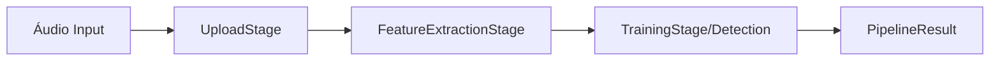

# Arquitetura do Sistema

O sistema XfakeSong segue os princípios da **Clean Architecture** (Arquitetura Limpa), separando responsabilidades em camadas concêntricas para garantir independência de frameworks, testabilidade e manutenibilidade.

## Visão Geral das Camadas

### 1. Domain (Domínio)
*Caminho: `app/domain/`*
Esta é a camada central do sistema, contendo a lógica de negócios e as regras corporativas. Ela não depende de nenhuma camada externa.
- **Features**: Lógica de extração de características de áudio (`app/domain/features`).
- **Interfaces**: Definições de contratos (classes abstratas) para serviços e repositórios.

### 2. Application (Aplicação)
*Caminho: `app/application/`*
Contém os casos de uso e a orquestração do fluxo de dados.
- **Pipeline**: O padrão principal de execução do sistema.
- **DTOs**: Data Transfer Objects para comunicação entre camadas.

### 3. Core (Núcleo/Infraestrutura)
*Caminho: `app/core/`*
Fornece funcionalidades transversais e implementações de infraestrutura.
- **Config**: Gerenciamento de configurações (`settings.py`).
- **Utils**: Utilitários de sistema, áudio e arquivos.
- **Interfaces**: Contratos base do sistema.

### 4. Interface Adapters (Controladores)
*Caminho: `app/controllers/`*
Adaptam os dados externos para o formato que os casos de uso e entidades esperam.
- **API Controllers**: Controladores para endpoints REST.
- **Main Controller**: Ponto de entrada para a aplicação CLI/Gradio.

## Padrão Pipeline

O sistema utiliza o padrão **Pipeline** para processar o fluxo de detecção de deepfakes de forma sequencial e organizada. O orquestrador (`Orchestrator`) gerencia a execução de estágios (`PipelineStage`).

### Fluxo do Pipeline

1. **UploadStage**: Recebe arquivos de áudio e valida formatos.
2. **FeatureExtractionStage**: Extrai características matemáticas do áudio.
3. **TrainingStage**: Treina ou utiliza modelos de Machine Learning.
4. **DetectionStage**: (Em inferência) Classifica o áudio como Real ou Fake.

### Componentes do Pipeline

- **PipelineConfig**: Dataclass que contém configurações de execução (batch size, epochs, tipos de features).
- **PipelineResult**: Objeto padronizado retornado por cada estágio, contendo status, dados, mensagens de erro e métricas de tempo.
- **PipelineStage**: Classe base abstrata que define o contrato `execute()`.

## Benefícios desta Arquitetura

1. **Desacoplamento**: A lógica de extração de features pode evoluir sem afetar a interface de usuário.
2. **Testabilidade**: Cada estágio do pipeline pode ser testado isoladamente.
3. **Flexibilidade**: Novos estágios podem ser adicionados ao pipeline sem reescrever o orquestrador.
