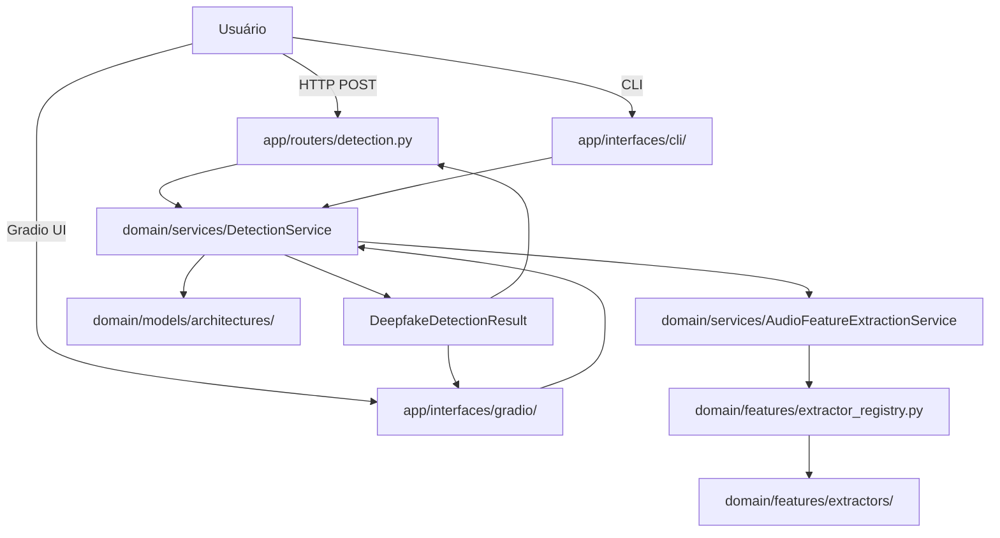
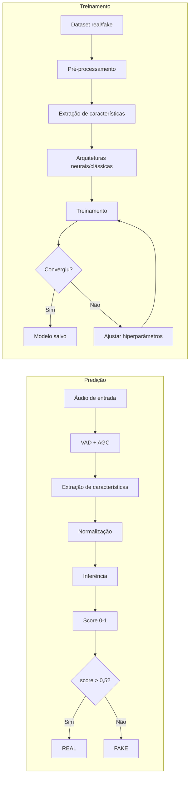

# Arquitetura do Sistema

O sistema XFakeSong segue os princípios da **Clean Architecture** (Arquitetura Limpa), separando responsabilidades em camadas concêntricas para garantir independência de frameworks, testabilidade e manutenibilidade.

## Visão Geral das Camadas

### 1. Domain (Domínio)
*Caminho: `app/domain/`*

Camada central — contém toda a lógica de negócio. Não depende de frameworks externos.

- **`features/`**: Extração de características de áudio (extratores, registry, adapters).
- **`models/`**: Arquiteturas neurais e ML clássico (WavLM, HuBERT, AASIST, etc.).
- **`services/`**: Serviços de negócio (DetectionService, TrainingService, UploadService, etc.).

### 2. Application (Aplicação)
*Caminho: `app/application/`*

Orquestração e casos de uso. Coordena domain sem conter regras de negócio.

- **`pipeline/`**: Orquestrador de estágios sequenciais (UploadStage → FeatureExtractionStage → DetectionStage).
- **`use_cases/`**: Casos de uso específicos.
- **`dto/`**: Data Transfer Objects para comunicação entre camadas.

### 3. Core (Núcleo/Infraestrutura)
*Caminho: `app/core/`*

Funcionalidades transversais usadas por todas as camadas.

- **`interfaces/`**: Contratos abstratos base (SOLID) — `audio.py`, `base.py`, `services.py`.
- **`config/`**: Configuração centralizada via `settings.py` + `.env`.
- **`training/`**: Pipeline de treinamento seguro e validação cruzada temporal.
- **`utils/`**: Utilitários de áudio, arquivos e sistema.
- **`auth/`**, **`security.py`**, **`middleware.py`**: Segurança, rate-limiting e CORS.

### 4. Interfaces (Adaptadores de Entrada)
*Caminho: `app/interfaces/`*

Adapta entradas externas (usuário, HTTP, CLI) para o domínio.

- **`gradio/`**: Interface web com 5 seções role-based (Painel, Detectar, Investigar, Treinar, Gerenciar).
- **`cli/`**: Interface de linha de comando com menus interativos.

### 5. Routers (API REST)
*Caminho: `app/routers/`*

Endpoints FastAPI organizados por domínio.

- `detection.py`, `training.py`, `features.py`, `datasets.py`, `history.py`, `voice_profiles.py`, `system.py`

---

## Fluxo de Requisição


```mermaid
graph TD
    U[Usuário] -->|HTTP POST| R[app/routers/detection.py]
    U -->|Gradio UI| G[app/interfaces/gradio/]
    U -->|CLI| C[app/interfaces/cli/]

    R --> DS[domain/services/DetectionService]
    G --> DS
    C --> DS

    DS --> FE[domain/services/AudioFeatureExtractionService]
    DS --> ML[domain/models/architectures/]

    FE --> REG[domain/features/extractor_registry.py]
    REG --> EXT[domain/features/extractors/]

    DS --> OUT[DeepfakeDetectionResult]
    OUT --> R
    OUT --> G
```

## Fluxograma Experimental do Sistema

O artigo consolidado descreve o sistema em duas fases: **predição** e
**treinamento**. A documentação abaixo espelha o fluxograma usado no `.tex`,
mas em Mermaid para renderização no GitHub Pages.


```mermaid
flowchart LR
    subgraph P["Predição"]
        A["Áudio de entrada"] --> B["VAD + AGC"]
        B --> C["Extração de características"]
        C --> D["Normalização"]
        D --> E["Inferência"]
        E --> F["Score 0-1"]
        F --> G{"score > 0,5?"}
        G -->|"Sim"| H["REAL"]
        G -->|"Não"| I["FAKE"]
    end

    subgraph T["Treinamento"]
        J["Dataset real/fake"] --> K["Pré-processamento"]
        K --> L["Extração de características"]
        L --> M["Arquiteturas neurais/clássicas"]
        M --> N["Treinamento"]
        N --> O{"Convergiu?"}
        O -->|"Sim"| Q["Modelo salvo"]
        O -->|"Não"| P2["Ajustar hiperparâmetros"]
        P2 --> N
    end
```

Esse fluxo é implementado por serviços reais do projeto:

| Etapa | Implementação principal |
|---|---|
| Upload/validação | `app/domain/services/upload_service.py` |
| Extração de características | `app/domain/services/feature_extraction_service.py` |
| Treinamento | `app/domain/services/training_service.py` |
| Fábrica de modelos | `app/domain/models/architectures/factory.py` |
| Inferência | `app/domain/services/detection/predictor.py` |
| Métricas e relatórios | `app/domain/models/training/metrics.py`, `benchmarks/report.py` |

## Padrão Pipeline

O orquestrador (`DeepfakePipelineOrchestrator`) gerencia estágios sequenciais via padrão **Chain of Responsibility**:

```
UploadStage → FeatureExtractionStage → TrainingStage / DetectionStage → PipelineResult
```

Cada `PipelineStage` retorna um `PipelineResult` com `status`, `data`, `error` e `execution_time`. Se um estágio falha (`ProcessingStatus.ERROR`), o pipeline é interrompido.

!!! note "Pipeline orquestrado × fluxo de produção"
    O pipeline orquestrado (`app/application/pipeline/`) é usado para fluxos
    customizados. O fluxo de produção padrão chama `DetectionService`
    diretamente via routers e Gradio.

---

## Padrões de Design Utilizados

| Padrão | Onde | Propósito |
|--------|------|-----------|
| Registry | `extractor_registry.py`, `architectures/registry.py` | Descoberta dinâmica de extratores e modelos |
| Factory | `architectures/factory.py` | Criação de modelos por nome/string |
| Pipeline | `application/pipeline/` | Processamento sequencial com rollback |
| Singleton | `app/dependencies.py` | Serviços compartilhados via `lru_cache` |
| Strategy | `IFeatureExtractor` implementations | Algoritmos de extração intercambiáveis |

---

## Estrutura de Diretórios

```
XFakeSong/
├── app/                            # Código-fonte principal
│   ├── application/                # Casos de uso e pipeline
│   │   ├── dto/
│   │   ├── pipeline/               # Orquestrador + estágios
│   │   └── use_cases/
│   │
│   ├── core/                       # Infraestrutura transversal
│   │   ├── auth/                   # JWT, auth handler
│   │   ├── config/                 # settings.py (SystemConfig)
│   │   ├── exceptions.py           # Exceções customizadas de domínio
│   │   ├── interfaces/             # Contratos abstratos SOLID
│   │   │   ├── audio.py            # AudioData, AudioFeatures, FeatureType
│   │   │   ├── base.py             # ProcessingResult, ProcessingStatus
│   │   │   └── services.py         # IDetectionService, ITrainingService, etc.
│   │   ├── middleware.py           # CORS, error handlers
│   │   ├── security.py             # Rate limiter, sanitização
│   │   ├── training/               # Secure training pipeline, CV temporal
│   │   └── utils/                  # Audio, file, system utils
│   │
│   ├── datasets/                   # Áudios para treinamento
│   │   ├── fake/
│   │   └── real/
│   │
│   ├── dependencies.py             # Injeção de dependência (lru_cache singletons)
│   │
│   ├── domain/                     # Regras de negócio puras
│   │   ├── features/               # Sistema de extração de features
│   │   │   ├── extractors/         # Implementações por categoria
│   │   │   │   ├── cepstral/       # MFCC, PLP, LPCC
│   │   │   │   ├── spectral/       # Spectral features
│   │   │   │   ├── prosodic/       # F0, jitter, shimmer
│   │   │   │   └── (+ 10 outros)
│   │   │   ├── adapters/
│   │   │   ├── extractor_registry.py
│   │   │   ├── interfaces.py       # IFeatureExtractor
│   │   │   └── types.py            # FeatureType, ProcessingResult (domain)
│   │   │
│   │   ├── models/                 # Modelos ML/DL
│   │   │   ├── architectures/      # 14 arquiteturas (ver docs/08_ARQUITETURAS.md)
│   │   │   │   ├── factory.py      # Criação por nome
│   │   │   │   └── registry.py     # Registro de arquiteturas
│   │   │   ├── training/           # Configurações de treinamento otimizadas
│   │   │   └── inference/          # Helpers de inferência
│   │   │
│   │   └── services/               # Serviços de negócio
│   │       ├── detection_service.py
│   │       ├── training_service.py
│   │       ├── feature_extraction_service.py
│   │       ├── upload_service.py
│   │       ├── audio_segmentation_service.py
│   │       ├── voice_profile_service.py
│   │       ├── forensic_visualization.py
│   │       ├── shap_interpreter.py
│   │       └── plugin_system.py
│   │
│   ├── interfaces/                 # Adaptadores de entrada
│   │   ├── gradio/                 # Interface web (5 seções role-based)
│   │   │   └── tabs/               # dashboard, detection, forensic_analysis, training_wizard, ...
│   │   └── cli/                    # Interface CLI com menus
│   │       └── menus/
│   │
│   ├── routers/                    # Endpoints FastAPI
│   │   ├── detection.py            # POST /api/v1/detection/analyze
│   │   ├── training.py             # POST /api/v1/training/start
│   │   ├── features.py             # POST /api/v1/features/extract
│   │   ├── datasets.py
│   │   ├── history.py
│   │   ├── voice_profiles.py
│   │   └── system.py
│   │
│   └── schemas/                    # Modelos Pydantic (request/response)
│       └── api_models.py
│
├── docs/                           # Documentação
├── tests/                          # Testes (unit/, integration/, api/, functional/)
├── scripts/                        # Scripts utilitários
├── gradio_app.py                   # App unificado (FastAPI + Gradio via Uvicorn)
├── main.py                         # Entry point (CLI ou --gradio)
├── app.py                          # Entry point para Hugging Face Spaces
└── requirements.txt
```

### Pontos-chave

- **`app/domain/`** — nunca importa de `app/interfaces/`, `app/routers/` ou frameworks externos diretamente.
- **`app/core/interfaces/`** — define os contratos SOLID que garantem desacoplamento; consulte aqui para entender o "contrato" de cada componente.
- **`app/dependencies.py`** — singletons via `lru_cache`; ponto único para obter instâncias dos serviços.
- **`app/datasets/`** — espera subpastas `real/` e `fake/` para treinamento supervisionado.
- **`tests/`** — espelha a estrutura de `app/` com camadas `unit/`, `integration/`, `api/` e `functional/`.
