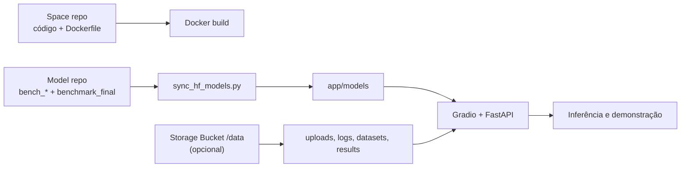

# Deploy no Hugging Face Spaces

Este guia descreve o deploy do XFakeSong no Hugging Face usando **Docker
Spaces**, **GPU Spaces** e **Storage Bucket**. O fluxo recomendado para
apresentação é executar a aplicação em modo demonstração, usando os modelos já
treinados e publicados em um repositório do tipo **Model** no Hugging Face Hub.

## Arquitetura de Deploy



Use **Docker Space** porque o projeto precisa controlar TensorFlow/Keras,
PyTorch/Transformers, FFmpeg, healthcheck, permissões, porta `7860` e
sincronização dos modelos treinados. O Gradio SDK simples não é recomendado para
o sistema completo.

## Pré-Requisitos

- Conta no Hugging Face.
- Space criado como **Docker**.
- Modelos finais consolidados em `app/models/`.
- Repositório do tipo **Model**, por exemplo
  `SEU_USUARIO/xfakesong-models`.
- `HF_TOKEN` se o model repo for privado.
- GPU paga apenas se quiser acelerar modelos pesados ou treinar no Space.
- Storage Bucket apenas se quiser persistir uploads, datasets, logs, resultados
  ou novos modelos gerados dentro do Space.

## 1. Criar o Docker Space

No Hugging Face:

1. Acesse **Spaces → Create new Space**.
2. Defina nome, licença e visibilidade.
3. Selecione **SDK: Docker**.
4. Faça push do projeto para o repositório do Space.
5. Acompanhe o build na aba **Logs**.

O `README.md` do Space deve conter o bloco YAML:

```yaml
---
title: XFakeSong
emoji: 🛡️
colorFrom: blue
colorTo: slate
sdk: docker
app_port: 7860
pinned: false
license: mit
---
```

Arquivos usados no deploy:

| Arquivo | Função |
| --- | --- |
| `Dockerfile` | build multi-stage da aplicação |
| `docker-entrypoint.sh` | prepara diretórios e sincroniza modelos |
| `main.py` | inicia Gradio/FastAPI com `python main.py --gradio` |
| `scripts/sync_hf_models.py` | baixa artefatos do Model Hub para `app/models` |
| `requirements.txt` | dependências TensorFlow, PyTorch e runtime |

## 2. Publicar os Modelos no Model Hub

Os pesos devem ficar em um repositório separado do tipo **Model** para evitar
rebuilds pesados do Space e permitir atualização independente dos modelos.

Faça uma simulação:

```bash
python scripts/upload_models_to_hf.py \
  --repo-id SEU_USUARIO/xfakesong-models \
  --dry-run
```

Envie os modelos:

```bash
python scripts/upload_models_to_hf.py \
  --repo-id SEU_USUARIO/xfakesong-models \
  --private
```

Remova `--private` se o repositório deve ser público.

O upload inclui:

```text
app/models/bench_*                  # modelos carregáveis pela UI/API
app/models/benchmark_final/         # cópia completa por arquitetura
app/models/benchmark_final_manifest.json
```

## 3. Configurar Variables e Secrets

No Space, abra **Settings → Variables and secrets**.

### Demonstração com modelos já treinados

| Tipo | Nome | Valor recomendado |
| --- | --- | --- |
| Variable | `MODEL_REPO_ID` | `SEU_USUARIO/xfakesong-models` |
| Variable | `ENABLE_TRAINING` | `false` |
| Variable | `XFAKE_SYNC_MODELS_ON_BOOT` | `true` |
| Variable | `DEEPFAKE_MODELS_DIR` | `app/models` |
| Variable | `DEEPFAKE_ENV` | `production` |
| Variable | `GRADIO_SERVER_NAME` | `0.0.0.0` |
| Variable | `GRADIO_SERVER_PORT` | `7860` |
| Variable | `GRADIO_ANALYTICS_ENABLED` | `false` |
| Variable | `XFAKE_CREATE_DEFAULT_MODELS` | `false` |
| Secret | `HF_TOKEN` | token com leitura do model repo, se privado |

No boot, `docker-entrypoint.sh` executa `scripts/sync_hf_models.py`. Se
`MODEL_REPO_ID` estiver definido, os modelos são sincronizados para
`app/models`. Se não estiver definido, o app usa os modelos já presentes no
projeto.

Com `ENABLE_TRAINING=false`, a aba **Treinar** fica desativada para evitar
execução pesada acidental. A aba **Detectar** continua usando os modelos já
treinados.

### Treino controlado dentro do Space

Use somente em ambiente com GPU e Storage Bucket:

```env
ENABLE_TRAINING=true
XFAKE_STORAGE_DIR=/data
XFAKE_CREATE_DEFAULT_MODELS=false
DEEPFAKE_ENV=production
```

Depois do treino ou benchmark, volte para:

```env
ENABLE_TRAINING=false
```

## 4. Configurar GPU Spaces

GPU não é obrigatória para abrir a interface, mas é recomendada para modelos
pesados e necessária para treinos neurais viáveis.

### Escolha de Hardware

| Uso | Hardware sugerido | Observação |
| --- | --- | --- |
| Demo leve com SVM/RF/Sonic Sleuth | CPU Upgrade ou T4 | menor custo |
| Demo com todos os modelos disponíveis | L4 | bom equilíbrio entre RAM e VRAM |
| WavLM/HuBERT originais | L4 ou A10G | PyTorch + Transformers |
| Treino neural individual | L4, A10G ou A100 | usar Storage Bucket |
| Benchmark completo | A10G/A100 temporário | reduzir hardware após concluir |

### Ativar GPU

1. Abra o Space.
2. Vá em **Settings → Hardware**.
3. Escolha o hardware, por exemplo **Nvidia L4**.
4. Aguarde o restart.
5. Verifique os logs.

Sinais esperados:

```text
TensorFlow GPU: [PhysicalDevice(..., device_type='GPU')]
torch.cuda.is_available(): True
```

O XFakeSong usa TensorFlow/Keras na maioria dos modelos e PyTorch/Transformers
para WavLM/HuBERT originais. Em GPU Spaces, o Docker deve ser reconstruído com
as dependências CUDA disponíveis no runtime.

### Controle de Custo

Spaces pagos são cobrados enquanto estão `Starting` ou `Running`. Para reduzir
custo:

1. Use GPU apenas durante testes, apresentação ou treino.
2. Reduza para CPU/T4 quando a demo pesada não for necessária.
3. Pause o Space quando não estiver em uso.

## 5. Configurar Storage Bucket

O disco padrão do Space é efêmero. Use Storage Bucket quando os arquivos
precisarem sobreviver a restart.

### Quando Usar

| Cenário | Precisa de Storage? |
| --- | --- |
| Demo apenas com modelos do Model Hub | Não obrigatório |
| Uploads persistentes | Sim |
| Logs permanentes | Sim |
| Treinamento dentro do Space | Sim |
| Benchmark e relatórios | Sim |
| Cache de datasets grandes | Sim |

### Montagem Recomendada

Monte o bucket em:

```text
/data
```

Configure:

```env
XFAKE_STORAGE_DIR=/data
```

Com essa variável, o app usa:

| Tipo | Caminho |
| --- | --- |
| Modelos treinados | `/data/models` |
| Datasets | `/data/datasets` |
| Uploads | `/data/uploads` |
| Logs | `/data/logs` |
| Temporários | `/data/temp` |

Também é possível sobrescrever apenas os modelos com:

```env
DEEPFAKE_MODELS_DIR=/data/models
```

## 6. Fluxos Recomendados

### 6.1 Demonstração com Modelos Já Treinados

1. Criar Docker Space.
2. Subir modelos para `SEU_USUARIO/xfakesong-models`.
3. Configurar `MODEL_REPO_ID`.
4. Configurar `ENABLE_TRAINING=false`.
5. Selecionar CPU Upgrade, T4 ou L4.
6. Abrir a aba **Detectar**.
7. Confirmar que os 14 modelos aparecem.
8. Testar inferência com um áudio curto.

### 6.2 Demonstração com Persistência

1. Seguir o fluxo 6.1.
2. Criar Storage Bucket.
3. Montar em `/data`.
4. Configurar `XFAKE_STORAGE_DIR=/data`.
5. Confirmar que uploads e logs persistem após restart.

### 6.3 Treino Individual no Space

1. Ativar GPU L4/A10G/A100.
2. Montar Storage Bucket em `/data`.
3. Configurar `ENABLE_TRAINING=true`.
4. Configurar `XFAKE_STORAGE_DIR=/data`.
5. Treinar um modelo por vez.
6. Salvar em `/data/models`.
7. Enviar os modelos finais ao Model Hub.
8. Voltar para `ENABLE_TRAINING=false`.

### 6.4 Benchmark Completo

Para benchmark completo, prefira execução controlada em Colab/WSL/Docker local
ou GPU Space temporário com Storage Bucket:

```bash
export XFAKE_STORAGE_DIR=/data
export XFAKE_CREATE_DEFAULT_MODELS=false

python scripts/run_tcc_pipeline.py \
  --download \
  --target-per-class 7500 \
  --full-benchmark \
  --epochs 100 \
  --batch-size 32 \
  --latency-runs 30 \
  --snr 30 20 10 \
  --duration-sec 5.0 \
  --archs \
    AASIST RawGAT-ST EfficientNet-LSTM MultiscaleCNN \
    SpectrogramTransformer Conformer Ensemble "Sonic Sleuth" \
    RawNet2 WavLM HuBERT "Hybrid CNN-Transformer" \
    SVM RandomForest \
  --out /data/results/tcc_all_architectures \
  --npz /data/datasets/benchmark_audio_raw_balanced_15k.npz
```

Artefatos esperados:

```text
/data/models/
/data/models/benchmark_final/
/data/results/tcc_all_architectures/
/data/datasets/benchmark_audio_raw_balanced_15k.npz
```

## 7. Checklist Pós-Deploy

### Build

- O build terminou sem erro.
- Os logs mostram `Starting XFakeSong`.
- O healthcheck responde em `/api/v1/system/health` ou `/`.

### Modelos

- Logs mostram `sync_hf_models`.
- Se `MODEL_REPO_ID` estiver definido, não há artefatos ausentes.
- A aba **Detectar** lista 14 modelos.
- O startup não carrega todos os pesos de uma vez; os modelos são carregados sob
  demanda.

### Interface

- A URL `https://SEU_USUARIO-NOME_DO_SPACE.hf.space/` abre.
- A aba **Treinar** está desativada quando `ENABLE_TRAINING=false`.
- Upload de áudio funciona.

### Inferência

Teste pelo menos:

- `bench_sonic_sleuth`
- `bench_svm`
- `bench_randomforest`
- um modelo pesado, como `bench_spectrogramtransformer`, se houver GPU/RAM.

### Storage

Se `/data` estiver montado:

- Faça um upload.
- Gere uma análise.
- Reinicie o Space.
- Confirme que arquivos persistiram em `/data`.

## 8. Acesso via API

O Gradio expõe endpoints automaticamente. Use `gradio_client`:

```bash
pip install gradio_client
```

```python
from gradio_client import Client

client = Client("SEU_USUARIO/NOME_DO_SPACE")
client.view_api()
```

Os nomes dos endpoints podem mudar conforme a composição da interface. Use
`view_api()` no Space publicado para obter os endpoints reais.

## 9. Problemas Comuns

| Sintoma | Causa provável | Correção |
| --- | --- | --- |
| Space abre sem modelos | `MODEL_REPO_ID` ausente ou repo privado sem token | configurar `MODEL_REPO_ID` e `HF_TOKEN` |
| Erro em WavLM/HuBERT | PyTorch/Transformers ou GPU indisponível | usar imagem atualizada e GPU L4/A10G |
| O app reinicia durante carga | memória insuficiente | usar lazy loading, L4/A10G, ou testar modelos menores |
| Arquivos somem após restart | disco efêmero | anexar Storage Bucket em `/data` |
| Treino aparece na demo pública | `ENABLE_TRAINING` não definido | configurar `ENABLE_TRAINING=false` |
| Build lento | dependências grandes e modelos no repo do Space | manter modelos em Model Hub separado |

