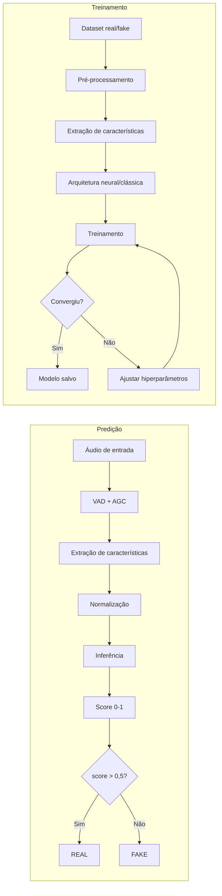

# Estudo Experimental de Detecção de Áudio Sintético

Esta página organiza, em formato de documentação navegável, a fundamentação
técnica e a análise experimental do XFakeSong. A fonte LaTeX em
`tcc_overleaf/main.tex` continua sendo um artefato acadêmico separado; esta
versão existe para consulta técnica no GitHub Pages.

## Resumo técnico

O XFakeSong é um pipeline modular e de código aberto para detecção de áudio
sintético. A metodologia integra pré-processamento, extração de características
acústicas, treinamento supervisionado, inferência e geração automática de
relatórios de benchmark.

O experimento consolidado avalia **14 arquiteturas** sobre uma base balanceada
com **15.000 amostras** de áudio, divididas em 70/15/15 para treino, validação
e teste. As janelas foram padronizadas em **16 kHz**, mono e **5 s**. Modelos
neurais foram treinados em GPU NVIDIA RTX 3060 via WSL2/CUDA; SVM e Random
Forest foram otimizados por validação cruzada em CPU.

Principais resultados no conjunto de teste limpo:

| Modelo | Accuracy | EER | AUC-ROC | Decisão |
|---|---:|---:|---:|---|
| Conformer | 100,00% | 0,00% | 1,000 | Demonstração principal |
| Sonic Sleuth | 100,00% | 0,00% | 1,000 | Opção leve e estável |
| Hybrid CNN-Transformer | 99,96% | 0,00% | 1,000 | Melhor compromisso neural |
| MultiscaleCNN | 99,73% | 0,18% | 1,000 | Comparação convolucional |
| SVM | 99,02% | 0,98% | 1,000 | Baseline rápido em CPU |
| Random Forest | 98,18% | 1,91% | 0,999 | Baseline clássico complementar |
| Spectrogram Transformer | 71,51% | 28,67% | 0,807 | Requer novo ajuste |

## Objetivos

### Objetivo geral

Desenvolver um pipeline modular, reprodutível e extensível para detecção de
áudio sintético, capaz de comparar arquiteturas clássicas e neurais sob o mesmo
protocolo experimental.

### Objetivos específicos

- Implementar e comparar quatorze arquiteturas especializadas.
- Padronizar pré-processamento, extração de características, treinamento e
  inferência.
- Avaliar robustez sob ruído AWGN em múltiplos níveis de SNR.
- Gerar relatórios, gráficos, matrizes de confusão, métricas e artefatos por
  arquitetura.
- Consolidar um conjunto de resultados numéricos para o TCC e para a
  demonstração da interface Gradio/API.

## Fundamentação: síntese e detecção

### Clonagem de voz

A clonagem de voz sintetiza uma nova fala preservando características do
falante. No artigo, esse processo é descrito por:

$$
\mathbf{y}_{clone} = f_{\theta}(\mathbf{x}_{text}, \mathbf{s}_{ref})
$$

em que \(\mathbf{y}_{clone}\) é o áudio sintético gerado,
\(\mathbf{x}_{text}\) é o texto de entrada, \(\mathbf{s}_{ref}\) representa a
referência vocal e \(f_{\theta}\) é o modelo neural treinado.

### Conversão de voz

A conversão de voz transforma a identidade vocal de um áudio de entrada sem
necessariamente alterar o conteúdo linguístico:

$$
\mathbf{y}_{vc} = g_{\phi}(\mathbf{x}_{source}, \mathbf{s}_{target})
$$

em que \(\mathbf{x}_{source}\) é a fala original e
\(\mathbf{s}_{target}\) representa a identidade vocal alvo.

### Síntese de fala

Sistemas TTS modernos mapeiam texto para representações acústicas e, depois,
para forma de onda:

$$
\mathbf{s}_{mel} = h_{\psi}(\mathbf{t}_{text}), \qquad
\mathbf{y}_{tts} = v_{\omega}(\mathbf{s}_{mel})
$$

\(\mathbf{t}_{text}\) é o texto, \(\mathbf{s}_{mel}\) é o espectrograma mel,
\(h_{\psi}\) é o modelo acústico e \(v_{\omega}\) é o vocoder.

### Manipulação em tempo real

Em cenários de baixa latência, a transformação pode ser vista como:

$$
\mathbf{y}_{rt}[n] = r_{\eta}(\mathbf{x}[n-L:n])
$$

em que \(L\) é a janela de contexto e \(r_{\eta}\) é o modelo de conversão em
tempo real.

## Gerações de métodos de detecção

| Geração | Representação | Classificador | Pontos fortes | Limitações |
|---|---|---|---|---|
| 1ª, até 2015 | MFCC, LFCC, CQCC | GMM-UBM, SVM | Baixo custo | Baixa generalização |
| 2ª, 2019 | Espectrograma mel | CNN, LSTM, LCNN | Artefatos de vocoder | Sensível a geradores não vistos |
| 3ª, 2021 | Forma de onda bruta, grafos | RawNet2, AASIST | EER baixo em bases controladas | GPU e dados suficientes |
| 4ª, 2024+ | Representação SSL | WavLM, HuBERT + MLP | Melhor generalização externa | Alto custo computacional |

## Fluxograma do pipeline



## Pré-processamento

### Normalização AGC

O controle automático de ganho ajusta o nível médio de loudness:

$$
x_{norm}[n] = x[n] \cdot 10^{\frac{L_{target} - L_{measured}}{20}}
$$

No experimento, \(L_{target} = -23\,\mathrm{LUFS}\).

### Detecção de atividade de voz

A energia por quadro é:

$$
E_m = \sum_{n=mH}^{mH+N-1} x^2[n] w[n-mH]
$$

O quadro é classificado como voz quando:

$$
V_m =
\begin{cases}
1, & 10\log_{10}(E_m) > \theta_{VAD}\\
0, & \text{caso contrário}
\end{cases}
$$

em que \(H\) é o passo de avanço, \(N\) é o tamanho da janela,
\(w[n]\) é a janela de análise e \(\theta_{VAD}\) é o limiar.

## Equações de extração de características

### Centroide espectral

$$
C_t = \frac{\sum_{k=0}^{K-1} f_k |X_t[k]|}{\sum_{k=0}^{K-1} |X_t[k]|}
$$

### Largura de banda espectral

$$
B_t = \left(
\frac{\sum_k (f_k - C_t)^2 |X_t[k]|}{\sum_k |X_t[k]|}
\right)^{1/2}
$$

### Roll-off espectral

$$
\sum_{k=0}^{k_r} |X_t[k]| = \alpha \sum_{k=0}^{K-1} |X_t[k]|
$$

com \(\alpha = 0{,}85\).

### Zero Crossing Rate

$$
ZCR_t = \frac{1}{2N}\sum_{n=1}^{N-1}
\left|\operatorname{sgn}(x_t[n]) - \operatorname{sgn}(x_t[n-1])\right|
$$

### Flatness espectral

$$
SF_t =
\frac{\left(\prod_{k=0}^{K-1}|X_t[k]|\right)^{1/K}}
{\frac{1}{K}\sum_{k=0}^{K-1}|X_t[k]|}
$$

### Contraste espectral

$$
SC_b = 10\log_{10}\left(\frac{\mu_{peaks,b}}{\mu_{valleys,b}}\right)
$$

### MFCC

$$
c_n = \sum_{m=0}^{M-1} \log(S_m)
\cos\left[\frac{\pi n}{M}\left(m+\frac{1}{2}\right)\right]
$$

### Espectrograma mel

$$
M[m,t] = \sum_{k=0}^{K-1} |X_t[k]|^2 H_m[k]
$$

### Características prosódicas

Frequência fundamental média:

$$
F0_{mean} = \frac{1}{T}\sum_{t=1}^{T} F0_t
$$

Jitter:

$$
Jitter = \frac{1}{N-1}\sum_{i=1}^{N-1}
\frac{|T_i - T_{i+1}|}{\bar{T}}
$$

Shimmer:

$$
Shimmer = \frac{1}{N-1}\sum_{i=1}^{N-1}
\frac{|A_i - A_{i+1}|}{\bar{A}}
$$

### Constant-Q Transform

$$
Q = \frac{f_k}{\Delta f_k}
$$

### Delta e delta-delta

$$
d_t =
\frac{\sum_{n=1}^{N} n(c_{t+n} - c_{t-n})}
{2\sum_{n=1}^{N} n^2}
$$

### Normalização estatística

Min-Max:

$$
X_{norm} = \frac{X - X_{min}}{X_{max} - X_{min}}
$$

Z-score:

$$
X_{norm} = \frac{X - \mu}{\sigma}
$$

## Ranking de características

| Grupo | Dimensão | Custo | Validação na literatura |
|---|---:|---|---|
| LFCC/CQCC | 20-84 | Médio | Muito usado em ASVspoof e front-ends clássicos |
| Mel espectrograma | 80-128 | Médio | Forte com CNN/Transformer |
| CQT | 84 | Alto | Boa resolução logarítmica |
| MFCC | 13-40 | Baixo | Baseline clássico |
| Prosódicas | 6 | Médio | Complementares, fracas isoladamente |

## Dataset consolidado

O benchmark utiliza `app/datasets/benchmark_audio_raw_balanced_15k.npz`.

| Atributo | Valor |
|---|---:|
| Total de amostras | 15.000 |
| Bonafide/real | 7.500 |
| Spoof/fake | 7.500 |
| Treino | 10.500 |
| Validação | 2.250 |
| Teste | 2.250 |
| Taxa de amostragem | 16 kHz |
| Duração | 5 s |
| Formato bruto | PCM mono normalizado, \(80.000 \times 1\) |
| Semente | 42 |
| Ruído | AWGN em 30, 20 e 10 dB |

Limitações atuais do manifesto: metadados completos de falante, gênero/idioma,
licença, duração original e duplicatas perceptuais ainda devem ser consolidados
para validação externa mais rigorosa.

## Arquiteturas avaliadas

| Família | Modelos | Entrada |
|---|---|---|
| SSL e áudio bruto | WavLM, HuBERT, RawNet2 | PCM 16 kHz |
| Grafos | AASIST, RawGAT-ST | Espectro-temporal / waveform |
| Espectrograma + atenção | Conformer, Hybrid CNN-Transformer, Spectrogram Transformer | Log-mel/espectrograma |
| CNN e fusão | Sonic Sleuth, EfficientNet-LSTM, MultiscaleCNN, Ensemble | LFCC/MFCC/CQT/log-mel |
| Clássicos | SVM, Random Forest | Características tabulares |

### Observações por modelo

- **WavLM e HuBERT**: usam backbones SSL reais quando disponíveis; preservam
  artefatos completos em `app/models/benchmark_final/<modelo>/`.
- **RawNet2**: processa forma de onda com filtros SincNet, blocos residuais e
  GRU.
- **AASIST e RawGAT-ST**: modelam dependências espectro-temporais com atenção em
  grafos.
- **Conformer**: combina convolução local e atenção global; foi o melhor modelo
  para demonstração principal.
- **Sonic Sleuth**: modelo leve baseado em características acústicas clássicas,
  com desempenho máximo no conjunto limpo.
- **Spectrogram Transformer**: treinou, mas apresentou instabilidade entre a
  melhor validação e o artefato final.
- **SVM e Random Forest**: baselines clássicos com GridSearchCV e paralelismo em
  CPU.

## Treinamento

### Função de perda

Para classificação binária:

$$
\mathcal{L}_{BCE} =
-\frac{1}{N}\sum_{i=1}^{N}
\left[y_i\log(\hat{y}_i) + (1-y_i)\log(1-\hat{y}_i)\right]
$$

### Regularização

O treinamento usa combinações de dropout, penalização L2, salvamento do melhor
checkpoint, redução de taxa de aprendizado e parada antecipada quando aplicável.

### Otimizador

Adam combina médias móveis de gradientes e gradientes ao quadrado:

$$
m_t = \beta_1 m_{t-1} + (1-\beta_1)g_t
$$

$$
v_t = \beta_2 v_{t-1} + (1-\beta_2)g_t^2
$$

$$
\theta_t = \theta_{t-1} -
\alpha \frac{\hat{m}_t}{\sqrt{\hat{v}_t}+\epsilon}
$$

## Ambiente experimental

| Item | Valor |
|---|---|
| Sistema | Windows 11 + WSL2 |
| GPU | NVIDIA GeForce RTX 3060 |
| CUDA | Usado no WSL2/Linux para modelos neurais |
| CPU | Usada para SVM/Random Forest e validação cruzada |
| Frameworks | TensorFlow/Keras, PyTorch, scikit-learn |
| Épocas neurais | 100 |
| Métricas | Accuracy, F1, AUC-ROC, EER, latência, robustez |

## Robustez a ruído

O benchmark aplica AWGN no espaço de entrada do modelo, mantendo o mesmo
protocolo para arquiteturas de áudio bruto, espectrograma e features
tabulares.

| Modelo | Limpo | 30 dB | 20 dB | 10 dB |
|---|---:|---:|---:|---:|
| Conformer | 100,00% | 100,00% | 99,91% | 94,18% |
| Sonic Sleuth | 100,00% | 100,00% | 100,00% | 83,24% |
| Hybrid CNN-Transformer | 99,96% | 99,96% | 99,64% | 88,49% |
| MultiscaleCNN | 99,73% | 99,73% | 99,56% | 82,04% |
| Ensemble | 95,82% | 77,69% | 67,60% | 52,00% |
| SVM | 99,02% | 50,00% | 50,00% | 50,00% |

O SVM apresentou queda para desempenho próximo ao acaso sob ruído, sugerindo
dependência forte da distribuição limpa das características.

## Estabilidade de treinamento

| Modelo | Melhor validação | Época | Validação final | Queda | Status |
|---|---:|---:|---:|---:|---|
| Conformer | 100,00% | 49 | 99,82% | 0,18% | Estável |
| Hybrid CNN-Transformer | 99,78% | 96 | 99,78% | 0,00% | Estável |
| MultiscaleCNN | 100,00% | 69 | 100,00% | 0,00% | Estável |
| AASIST | 94,13% | 100 | 94,13% | 0,00% | Estável |
| Ensemble | 98,71% | 62 | 95,56% | 3,16% | Estável |
| Spectrogram Transformer | 98,00% | 11 | 72,98% | 25,02% | Checkpoint obrigatório |

## Discussão

Os resultados sugerem três perfis de uso:

- **Máxima acurácia no conjunto atual**: Conformer, Sonic Sleuth, Hybrid
  CNN-Transformer e MultiscaleCNN.
- **Inferência leve e demonstração**: SVM e Sonic Sleuth.
- **Pesquisa e comparação com literatura moderna**: WavLM, HuBERT, RawNet2,
  AASIST e RawGAT-ST.

Alto desempenho no conjunto limpo não elimina a necessidade de validação
externa. A base é balanceada e controlada, o que favorece separabilidade. Os
resultados devem ser lidos como avaliação padronizada do pipeline e das
arquiteturas, não como prova definitiva de generalização para todos os vocoders,
idiomas, microfones e codecs.

## Ameaças à validade e limitações

- **Validade interna**: risco de vazamento se amostras do mesmo falante, canal,
  música ou gerador aparecerem em partições distintas.
- **Validade externa**: resultados precisam ser confirmados em ASVspoof,
  WaveFake, In-the-Wild e bases multi-gerador.
- **Metadados da base**: falantes, licenças, idiomas, duração original e fontes
  devem ser enriquecidos no manifesto.
- **Validade de construção**: acurácia, F1, AUC e EER não substituem análise de
  limiar operacional.
- **Robustez**: quedas sob AWGN indicam necessidade de treino com ruído,
  codecs e reverberação.
- **Custo computacional**: WavLM e HuBERT originais exigem armazenamento e GPU
  para treinamento viável.
- **Interpretabilidade**: SHAP, Grad-CAM espectral e oclusão temporal ainda
  devem ser integrados ao relatório automatizado.

## Considerações éticas e LGPD

Detectores de voz sintética devem ser usados como ferramentas de apoio, não como
mecanismos definitivos de acusação ou autenticação. Falsos positivos podem
prejudicar usuários legítimos; falsos negativos podem permitir aceitação de
áudios sintéticos como reais. Decisões sensíveis exigem revisão humana,
calibração de limiar, governança, controle de acesso e descarte seguro de
arquivos de entrada.

## Trabalhos futuros

- Reexecutar Spectrogram Transformer com checkpoint obrigatório, menor taxa de
  aprendizado, maior dropout, weight decay e early stopping.
- Incluir ASVspoof 2019/2021/5, WaveFake e In-the-Wild no preset de validação
  externa.
- Implementar validação cross-dataset e ablações por família de características.
- Registrar intervalos de confiança, testes pareados e curvas de calibração por
  arquitetura.
- Adicionar aumento de dados com AWGN, codecs, reverberação e variação de ganho.
- Integrar SHAP, Grad-CAM espectral ou oclusão temporal.

## Artefatos e rastreabilidade

| Artefato | Caminho | Finalidade |
|---|---|---|
| Fonte do artigo | `tcc_overleaf/main.tex` | Fonte única para Overleaf |
| Figuras finais | `tcc_overleaf/figures/*.png` | Gráficos usados no artigo |
| Dataset consolidado | `app/datasets/benchmark_audio_raw_balanced_15k.npz` | Entrada única do benchmark |
| Modelos padrão | `app/models/bench_*` | Inferência na Gradio/API |
| Modelos completos | `app/models/benchmark_final/<modelo>/` | Artefatos finais por arquitetura |
| Métricas | `results/<run>/architectures/<modelo>/metrics.json` | Auditoria por modelo |
| Relatório | `results/<run>/tcc_report.md` | Registro textual do benchmark |

## Comandos de reprodução

```bash
python main.py --bootstrap-dirs
python main.py --gradio
```

```bash
python scripts/run_tcc_pipeline.py \
  --download \
  --target-per-class 7500 \
  --full-benchmark \
  --epochs 100 \
  --device-profile gpu \
  --npz app/datasets/benchmark_audio_raw_balanced_15k.npz
```

```bash
python scripts/run_benchmark.py \
  --full \
  --epochs 100 \
  --device-profile gpu \
  --dataset app/datasets/benchmark_audio_raw_balanced_15k.npz
```

```bash
python scripts/run_benchmark.py \
  --model Conformer \
  --epochs 100 \
  --device-profile gpu \
  --dataset app/datasets/benchmark_audio_raw_balanced_15k.npz
```

## Matrizes de confusão completas

As matrizes completas ficam em:

```text
tcc_overleaf/figures/confusion_matrices/
```

Também são geradas por arquitetura dentro de:

```text
results/<run>/architectures/<modelo>/
```
