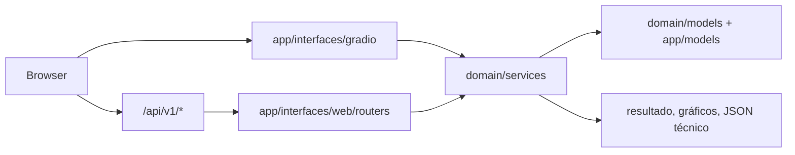

# 23 — Frontend Gradio e Fluxos de Análise

A interface Gradio é a superfície principal de demonstração do XFakeSong. Ela é
montada no mesmo processo FastAPI que expõe a API REST, permitindo usar UI e
HTTP lado a lado.

## Como iniciar

```bash
python main.py --gradio
```

ou via Docker:

```bash
docker compose up --build -d
```

| Recurso | URL |
|---|---|
| Interface Gradio | `http://localhost:7860/gradio` |
| Página inicial | `http://localhost:7860/` |
| Healthcheck | `http://localhost:7860/api/v1/system/health` |
| OpenAPI | `http://localhost:7860/api/docs` |

`app/interfaces/gradio/app.py` monta o app unificado usado pelo comando
principal. O módulo `app/interfaces/web/main_fastapi.py` também monta
FastAPI, templates, assets estáticos e, fora de pytest/modo API-only, a UI
Gradio em `/gradio`.

## Configurações Necessárias

Antes de abrir a interface, confirme:

| Item | Configuração recomendada |
|---|---|
| Modelos default | `app/models/benchmark_final/` e manifesto consolidado |
| Diretório de modelos | `DEEPFAKE_MODELS_DIR=app/models` |
| Porta | `GRADIO_SERVER_PORT=7860` |
| Host Docker/HF | `GRADIO_SERVER_NAME=0.0.0.0` |
| Ambiente demo | `DEEPFAKE_ENV=production` |
| Treino em demo pública | `ENABLE_TRAINING=false` |
| Sincronização HF | `MODEL_REPO_ID` + `XFAKE_SYNC_MODELS_ON_BOOT=true` |
| GPU | WSL2/Linux/Docker GPU ou Hugging Face GPU Space |
| Persistência | `XFAKE_STORAGE_DIR=/data` em Hugging Face Storage |

O healthcheck deve retornar `status=healthy` e `models_loaded` maior que zero
quando os modelos consolidados estão disponíveis.

## Comunicação com o Backend



Na UI, callbacks Gradio chamam serviços de domínio diretamente. Na API, routers
FastAPI chamam os mesmos serviços por dependências. O domínio permanece
independente de Gradio/FastAPI, e essa fronteira é protegida por testes de
integração.

## Estrutura da UI

O arquivo `app/interfaces/gradio/app.py` organiza a experiência em cinco seções:

| Seção | Arquivos principais | Papel |
|---|---|---|
| Painel | `tabs/dashboard.py` | KPIs, status, atividade recente |
| Detectar | `tabs/detection.py`, `tabs/voice_profiles.py` | análise de áudio, lote e perfis de voz |
| Investigar | `tabs/forensic_analysis.py` | inspeção forense e explicabilidade |
| Treinar | `tabs/training_wizard.py`, `tabs/optimization.py` | treino guiado e tuning |
| Gerenciar | `tabs/dataset_management.py`, `tabs/features.py`, `tabs/history.py` | datasets, features e histórico |

A barra superior mostra estado online, GPU, número de modelos, perfis,
notificações e toggles de tema/idioma. O painel de notificações consome o mesmo
buffer de feedback disponível em `/api/v1/system/feedback`.

## Aba Painel

Objetivo: visão rápida do estado do sistema.

| Bloco | Uso |
|---|---|
| KPIs | análises recentes, modelos carregados, perfis e datasets |
| Últimas análises | histórico resumido das predições |
| Status do sistema | ambiente, GPU, banco e armazenamento |
| Modelos disponíveis | cards resumindo arquiteturas carregáveis |

Use esta aba para confirmar se o app subiu corretamente e se os modelos default
foram encontrados antes de executar uma análise.

## Aba Detectar

Objetivo: executar inferência em áudio individual, streaming curto ou lote.

Fluxo recomendado:

1. Abra **Detectar → Análise de Áudio**.
2. Envie um arquivo `.wav`, `.mp3`, `.flac`, `.m4a`, `.ogg` ou grave pelo
   microfone.
3. Opcionalmente abra **Configurações Avançadas**.
4. Escolha arquitetura/modelo quando quiser forçar um artefato específico.
5. Use **Inferência Segmentada** para áudios longos.
6. Execute a análise.

Saídas:

| Saída | Descrição |
|---|---|
| Classificação | classe predita (`REAL`, `DEEPFAKE` ou erro operacional) |
| Confiança | probabilidade calibrada da classe predita |
| Forma de onda | visualização temporal do sinal |
| Espectrograma Mel | visualização tempo-frequência |
| Prosódia | energia RMS e pitch quando aplicável |
| JSON técnico | modelo usado, probabilidades, metadados e features |

Para lote, envie múltiplos arquivos e revise distribuição, tabela por arquivo e
relatório exportável. Para benchmark científico, prefira
`scripts/benchmark/run_tcc_pipeline.py` ou `scripts/benchmark/run_benchmark.py`.

## Serving de Inferência

Caminho operacional:

```text
Gradio -> DetectionService -> ModelLoader -> FeaturePreparer -> Predictor
```

Pontos que precisam permanecer alinhados:

- `input_contract` salvo pelo treino contém `input_shape`, `type/format`,
  `sample_rate`, `temperature`, `eer_threshold`, `ood_threshold`,
  `scaler_applied` e `label_classes`.
- `FeaturePreparer` prioriza o contrato salvo antes de usar fallback de
  registry.
- `Predictor` aplica temperature scaling, EER threshold, energy score para OOD
  e MC Dropout quando solicitado.
- A carga Keras registra `custom_objects` para camadas customizadas e
  extratores SSL.
- O áudio é reamostrado para o `sample_rate` do contrato antes da extração.

### Correção P0 consolidada

O problema corrigido estava na descoberta de modelos: `ModelLoader` buscava
apenas artefatos não recursivos em `app/models/*.keras|*.pkl`. Como os modelos
finais ficam em `app/models/benchmark_final/<arch>/bench_<arch>.*`, a UI podia
cair em modelos de demonstração não treinados.

A descoberta agora inclui `benchmark_final/*/bench_*.{keras,h5,pkl,pt}` com
deduplicação por caminho real e filtro pelo prefixo `bench_`, evitando capturar
checkpoints intermediários. Na árvore atual, a verificação registra os 11
modelos finais do recorte oficial sincronizado com seus `_config.json`; as
demais arquiteturas continuam disponíveis no catálogo/harness quando houver
artefatos publicados.

Itens remanescentes para próxima rodada:

- Gravar receita completa de features no `input_contract` durante retreino,
  incluindo `feature_types`, `n_mels`, `n_fft`, `hop_length` e LFCC/CQT quando
  aplicável.
- Recalibrar `temperature` e `eer_threshold` em validação representativa com
  ruído após retreino.

Detalhes de ajustes de retreino ficam em [Retreino com Ajustes](RETREINO_AJUSTES.md).

## Aba Investigar

Objetivo: análise forense e explicabilidade além da classificação binária.

| Análise | Finalidade |
|---|---|
| Forma de onda | inspeção visual de amplitude, cortes e silêncio |
| Espectrograma | padrões espectrais e artefatos de síntese |
| Features acústicas | MFCC, LFCC, CQT, RMS, ZCR e métricas espectrais |
| Prosódia | energia, pitch e variações temporais |
| Qualidade vocal | jitter, shimmer, HNR e estabilidade |
| Metadados | duração, sample rate e informações técnicas |
| Explicabilidade | regiões/atributos que influenciam a decisão quando disponível |

Use esta aba para explicar por que uma amostra foi classificada como suspeita e
para gerar material visual de apoio à apresentação.

## Aba Treinar

Objetivo: criar ou atualizar modelos a partir de datasets organizados.

| Etapa | Descrição |
|---|---|
| Dataset | seleção de dados reais/fake ou `.npz` consolidado |
| Modelo | arquitetura, variante e hiperparâmetros |
| Validação | split, balanceamento e checagens de compatibilidade |
| Execução | treino, progresso, métricas e salvamento |

Saídas esperadas:

- modelo salvo em `app/models/bench_<modelo>.*` ou na estrutura consolidada;
- config em `app/models/bench_<modelo>_config.json`;
- logs e métricas de treino;
- gráficos de convergência quando disponíveis;
- compatibilidade imediata com a aba **Detectar** e API.

Em deploy público ou apresentação, mantenha `ENABLE_TRAINING=false`. Para
treinamento real, prefira WSL2/Linux com GPU, Docker GPU ou Hugging Face GPU
Space com Storage.

## Aba Gerenciar

Objetivo: administrar datasets, histórico, modelos e artefatos.

| Área | Uso |
|---|---|
| Datasets | baixar, validar, balancear e preparar dados |
| Modelos | listar artefatos disponíveis e configs |
| Histórico | consultar análises e exportar registros |
| Perfis de voz | gerenciar amostras de referência quando habilitado |
| Sistema | ações de refresh, diagnóstico e limpeza controlada |

Para o benchmark oficial, a preparação robusta do dataset deve ser feita via
scripts. A aba Gerenciar serve para verificar se dados e modelos estão visíveis
para a aplicação.

## Relação com Benchmark e Notebooks

| Objetivo | Interface | Notebook/script equivalente |
|---|---|---|
| Testar um áudio | Detectar | `notebooks/pipeline/03_inference.ipynb` |
| Estudar features | Investigar | `notebooks/features/01_feature_extraction_study.ipynb` |
| Treinar um modelo | Treinar | `notebooks/pipeline/02_training_model.ipynb` |
| Rodar benchmark completo | Não recomendado pela UI | `scripts/benchmark/run_tcc_pipeline.py` |
| Auditar todos os modelos | Painel/Gerenciar | `notebooks/pipeline/04_all_architectures_full_benchmark.ipynb` |
| Gerar resultados do TCC | Scripts | [Benchmark e Resultados](15_BENCHMARK.md) |

## Checklist de Validação da UI

- `http://localhost:7860/gradio` abre sem erro.
- `/api/v1/system/health` retorna `healthy` ou um `degraded` explicável.
- A barra superior mostra GPU quando aplicável.
- A aba **Detectar** lista modelos treinados.
- Um áudio curto gera classificação, confiança, gráficos e JSON técnico.
- A aba **Investigar** renderiza forma de onda e espectrograma.
- A aba **Treinar** está desativada em demo pública ou habilitada apenas em
  ambiente controlado.
- A aba **Gerenciar** mostra datasets/modelos esperados.
- Logs do container não exibem stack trace após startup.

## Problemas Comuns

| Sintoma | Causa provável | Correção |
|---|---|---|
| Nenhum modelo aparece | `app/models` vazio ou `DEEPFAKE_MODELS_DIR` errado | sincronizar Model Hub ou restaurar `app/models/benchmark_final/` |
| Upload falha silenciosamente | `allowed_paths`/temp dir incorreto | usar build atual e `GRADIO_TEMP_DIR=/tmp/gradio` |
| Treino bloqueado | `ENABLE_TRAINING=false` | habilitar somente em ambiente de treino |
| GPU não aparece | Windows nativo/sem passthrough | usar WSL2, Docker GPU ou GPU Space |
| Space perde arquivos | disco efêmero | montar Storage em `/data` |
| Notificações acumulam | eventos do backend não lidos | abrir notificações e marcar como lidas |

## Testes Relacionados

```bash
./scripts/ops/run_tests.sh functional
./scripts/ops/run_tests.sh api
./scripts/ops/run_tests.sh smoke
```

Use smoke quando tocar em startup, wizard, `DetectionService`, `ModelLoader`,
`FeaturePreparer`, `Predictor` ou descoberta de modelos.
