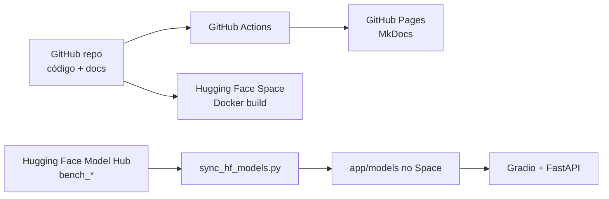

# 24 — Publicação no GitHub Pages e Hugging Face

Esta página consolida as configurações necessárias para manter a documentação no
GitHub Pages e a aplicação executável no Hugging Face Spaces.

## GitHub Pages

A documentação é publicada com MkDocs Material a partir de `docs/`.

| Item | Configuração |
| --- | --- |
| Config principal | `mkdocs.yml` |
| URL pública | `https://thierrybraga.github.io/XFakeSong/` |
| Workflow | `.github/workflows/static.yml` |
| Build local | `mkdocs build --strict` |
| Tema | `material`, idioma `pt-BR` |
| Extensões críticas | `pymdownx.superfences`, `pymdownx.arithmatex`, `attr_list` |
| Matemática | `docs/javascripts/mathjax.js` + MathJax CDN |
| CSS extra | `docs/stylesheets/extra.css` |

### Checklist do GitHub Pages

- `site_url` aponta para `https://thierrybraga.github.io/XFakeSong/`.
- Todo arquivo novo em `docs/` foi adicionado ao `nav` do `mkdocs.yml`.
- Links relativos usam caminhos dentro de `docs/`.
- Diagramas Mermaid estão em blocos ` ```mermaid `.
- Equações usam MathJax via `pymdownx.arithmatex`.
- `mkdocs build --strict` passa localmente ou no CI.
- O workflow `static.yml` tem permissão `pages: write` e `id-token: write`.

### Build Local

```bash
pip install "mkdocs>=1.6,<2.0" "mkdocs-material>=9.5,<10.0"
mkdocs build --strict
mkdocs serve
```

Use `mkdocs serve` para revisar em `http://127.0.0.1:8000/`.

## Hugging Face Spaces

O deploy recomendado é **Docker Space**, não Gradio SDK simples.

| Item | Configuração |
| --- | --- |
| SDK | `docker` |
| Porta | `app_port: 7860` |
| Startup | `python main.py --gradio` via `docker-entrypoint.sh` |
| Modelos | Model Hub separado, sincronizado por `scripts/sync_hf_models.py` |
| Variável de modelos | `MODEL_REPO_ID=SEU_USUARIO/xfakesong-models` |
| Storage opcional | `/data` com `XFAKE_STORAGE_DIR=/data` |
| Demo pública | `ENABLE_TRAINING=false` |

### README do Space

O `README.md` deve manter o front matter:

```yaml
---
title: XFakeSong
emoji: 🛡️
colorFrom: blue
colorTo: slate
sdk: docker
app_port: 7860
pinned: false
license: mit
---
```

### Variables e Secrets

| Tipo | Nome | Valor |
| --- | --- | --- |
| Variable | `MODEL_REPO_ID` | `SEU_USUARIO/xfakesong-models` |
| Variable | `XFAKE_SYNC_MODELS_ON_BOOT` | `true` |
| Variable | `DEEPFAKE_MODELS_DIR` | `app/models` |
| Variable | `ENABLE_TRAINING` | `false` para demo |
| Variable | `DEEPFAKE_ENV` | `production` |
| Variable | `GRADIO_SERVER_NAME` | `0.0.0.0` |
| Variable | `GRADIO_SERVER_PORT` | `7860` |
| Variable | `GRADIO_ANALYTICS_ENABLED` | `false` |
| Secret | `HF_TOKEN` | token com leitura do Model Hub privado |

Para treino ou benchmark dentro do Space:

```env
ENABLE_TRAINING=true
XFAKE_STORAGE_DIR=/data
DEEPFAKE_MODELS_DIR=/data/models
```

Depois da execução, envie os modelos finais ao Model Hub e volte
`ENABLE_TRAINING=false`.

## Publicação de Modelos

Os modelos consolidados usados pela Gradio/API ficam em `app/models/`.
Esse diretório deve conter os modelos pré-treinados com o dataset do benchmark
(`benchmark_audio_raw_balanced_15k.npz`) antes do upload.

```bash
python scripts/upload_models_to_hf.py \
  --repo-id SEU_USUARIO/xfakesong-models \
  --dry-run

python scripts/upload_models_to_hf.py \
  --repo-id SEU_USUARIO/xfakesong-models \
  --private
```

O upload deve incluir:

```text
models/bench_*
models/benchmark_final/
models/benchmark_final_manifest.json
```

Para baixar novamente os modelos do Hub:

```bash
MODEL_REPO_ID=SEU_USUARIO/xfakesong-models \
python scripts/sync_hf_models.py \
  --models-dir app/models \
  --force
```

Se o repositório for privado, defina `HF_TOKEN` ou `HUGGINGFACE_HUB_TOKEN`.
O mesmo comando é executado automaticamente no boot do Docker Space quando
`MODEL_REPO_ID` e `XFAKE_SYNC_MODELS_ON_BOOT=true` estão configurados.

## Relação entre GitHub, Pages, Space e Model Hub



## Checklist Final de Publicação

- README principal contém front matter compatível com Docker Space.
- `mkdocs.yml` inclui todas as páginas novas.
- `docs/15_BENCHMARK.md` documenta dataset, hiperparâmetros, saídas e modelos.
- `docs/16_NOTEBOOKS.md` documenta todos os notebooks ativos.
- `docs/23_INTERFACE_GRADIO.md` documenta abas e fluxos da UI.
- `docs/11_DEPLOY_HUGGINGFACE.md` detalha GPU Spaces e Storage.
- `app/models/` contém os modelos default usados na apresentação.
- O Space tem `MODEL_REPO_ID` e `HF_TOKEN` quando o Model Hub é privado.
- `ENABLE_TRAINING=false` em demonstrações públicas.
- Healthcheck do Space responde antes da apresentação.
