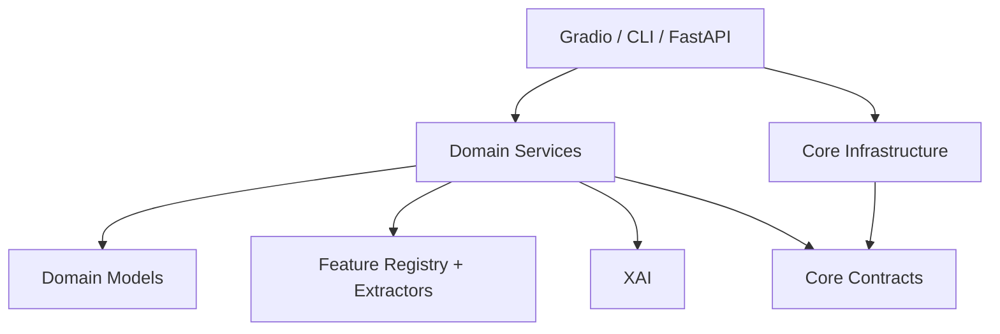

# Arquitetura modular proposta

Este documento consolida a arquitetura alvo para a reorganizacao atual do
`app/`, respeitando as decisoes ja documentadas em `03_ARQUITETURA.md`,
`07_API_COMUNICACAO.md`, `10_TREINAMENTO.md`, `15_BENCHMARK.md` e
`26_PLANO_AMBIENTES_TREINAMENTO.md`.

## Decisao principal

O projeto ja possui uma Clean Architecture funcional com tres camadas centrais:

- `app/domain`: dominio, servicos, features, modelos, treinamento, inferencia e XAI.
- `app/core`: contratos, configuracao e infraestrutura transversal.
- `app/interfaces`: adaptadores Gradio, FastAPI e CLI.

A reorganizacao segura deve evoluir essa estrutura por **bounded contexts**, nao
substitui-la por uma pasta generica `modules/` que duplicaria as fronteiras ja
existentes.

## Bounded contexts atuais

| Contexto | Pasta principal | Extracao futura |
| --- | --- | --- |
| Detection | `app/domain/services/detection*` | servico de inferencia |
| Training | `app/domain/services/training_service.py`, `app/domain/models/training/` | worker de treino |
| Features | `app/domain/features/`, `app/domain/services/feature_extraction*` | servico de features |
| Model Registry | `app/domain/models/architectures/` | registry/model hub interno |
| Dataset Metadata | `app/domain/dataset_metadata/` | servico de catalogo |
| Voice Profiles | `app/domain/services/voice_profile_service.py` | servico de perfis |
| XAI | `app/domain/xai/` | servico de explicabilidade |
| Interfaces | `app/interfaces/` | gateways HTTP/UI/CLI |

## Fluxo de dependencias

## Regras de arquitetura

- `app/domain` nao importa `app/interfaces`.
- Frameworks de entrada ficam em `app/interfaces`.
- Contratos canonicos ficam em `app/core/contracts`.
- `app/core/interfaces` e apenas compatibilidade temporaria para imports antigos.
- Artefatos de modelo podem permanecer em `app/models`, mas resultados de
  benchmark devem ser tratados como artefatos regeneraveis.

## Preparacao para microsservicos

A extracao para microsservicos deve acontecer quando cada contexto tiver:

1. contratos de entrada/saida estaveis;
2. testes de contrato;
3. armazenamento proprio ou interface de repositorio;
4. dependencia unidirecional de outros contextos;
5. pipeline de build/execucao independente.
