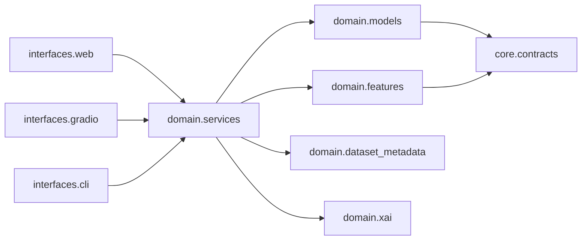

# Modulos do app

## Mapa de modulos

| Modulo | Responsabilidade | Entrada principal | Saida principal |
| --- | --- | --- | --- |
| `core` | infraestrutura transversal | env, request, runtime | config, contratos, middlewares |
| `domain.services` | casos de uso | comandos internos | resultados de dominio |
| `domain.features` | extracao de features | `AudioData` | `AudioFeatures` |
| `domain.models.architectures` | modelos ML/DL | shapes, params | modelos Keras/sklearn/PyTorch |
| `domain.models.training` | treino e metricas | dataset/config | artefatos, metricas |
| `domain.services.detection` | inferencia | audio + modelo | score/decisao |
| `domain.dataset_metadata` | catalogo de datasets | fonte/tier | metadados e manifests |
| `domain.xai` | explicabilidade | modelo/features | mapas/atribuicoes |
| `interfaces.web` | API REST | HTTP | JSON/HTML |
| `interfaces.gradio` | UI | eventos Gradio | componentes/visualizacoes |
| `interfaces.cli` | CLI | input interativo | comandos locais |
| `utils` | helpers puros | paths/audio/sistema | funcoes reutilizaveis |

## Relacao com DDD

O dominio principal e **Audio Deepfake Detection**. Os bounded contexts atuais
sao Detection, Training, Feature Extraction, Dataset Catalog, Model Registry,
Voice Profiles e Explainability.

## Dependencias desejadas

## Antipadroes a evitar

- importar Gradio/FastAPI dentro do dominio;
- criar servicos genericos sem dono de contexto;
- duplicar catalogos de modelos/datasets em UI, scripts e docs;
- embutir resultados de benchmark como fonte de verdade de codigo;
- esconder fallbacks de modelo sem metadados no `input_contract`.
