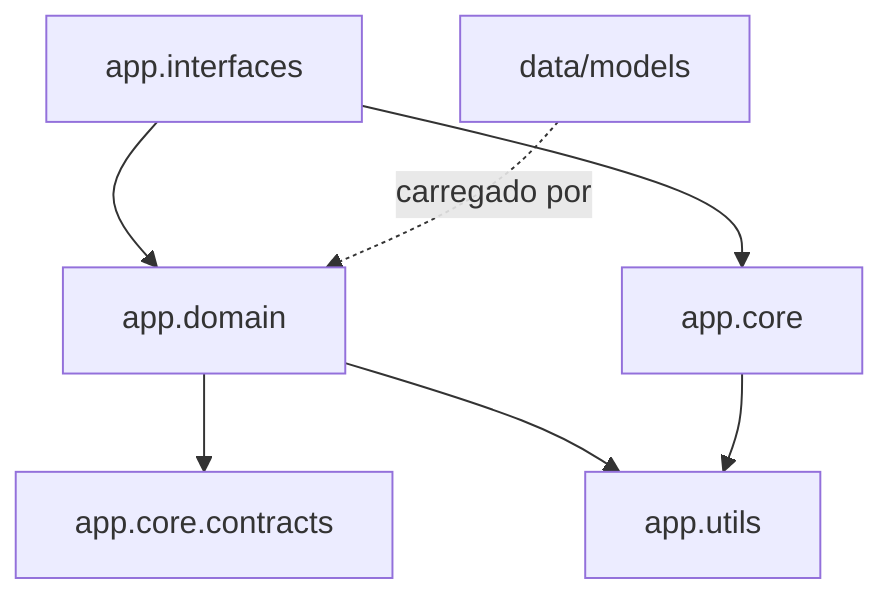

# Grafo de dependencias

## Grafo desejado



## Achados da auditoria

| Achado | Impacto | Recomendacao |
| --- | --- | --- |
| `app/domain` nao importa `app/interfaces` | positivo | manter protegido por teste |
| `app/core/db/setup.py` carrega modelos de dominio no bootstrap | acoplamento infra->dominio restrito ao ponto de composicao | mover bootstrap para infraestrutura dedicada quando houver repositorios explicitos |
| `benchmarks/` e uma interface publica de experimentos | alto uso por scripts/testes/notebooks | manter compatibilidade enquanto decide se vira modulo `evaluation` ou pacote externo |
| notebooks documentados usam `app.core.contracts.*` | positivo | manter aliases apenas para materiais externos legados |
| arquivos Gradio muito grandes | manutencao dificil | extrair callbacks e presenters por fluxo |

## Verificacao local recomendada

```bash
python -m pytest tests/integration/test_domain_imports_without_web_layer.py
python -m pytest tests/unit/test_schemas.py
python -m pytest tests/unit/test_benchmark.py
```
