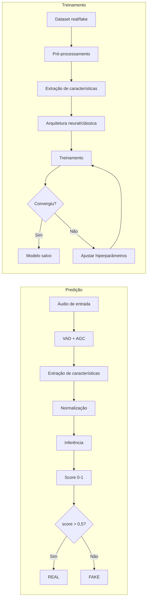

# Estudo Experimental de Detecção de Áudio Sintético

Esta página organiza, em formato de documentação navegável, a fundamentação
técnica e a análise experimental do XFakeSong. A fonte LaTeX em
`data/results/paper/main.tex` continua sendo um artefato acadêmico separado; esta
versão existe para consulta técnica no GitHub Pages.

## Resumo técnico

O XFakeSong é um pipeline modular e de código aberto para detecção de áudio
sintético. A metodologia integra pré-processamento, extração de características
acústicas, treinamento supervisionado, inferência e geração automática de
relatórios de benchmark.

O harness de benchmark suporta **14 arquiteturas**; o recorte oficial
consolidado no artigo (`data/results/paper/main.tex`) usa **11** delas, sobre o
tier `medium` canônico de 15k, com **15.000 amostras alvo** de áudio,
divididas em 70/15/15 para treino, validação e teste. As janelas foram
padronizadas em **16 kHz**, mono e **5 s**. A base ativa consolidada contém
15.000 WAVs PCM lineares, 16 bits, mono, 16 kHz, somando **2.045,61 min** de
áudio validado; o `.npz` canônico tem **2.769,01 MiB** e representa
**1.250,00 min** após o corte/padding de 5 s por amostra. Modelos neurais
foram treinados em GPU NVIDIA RTX 3060 via WSL2/CUDA; SVM e Random Forest
foram otimizados por validação cruzada em CPU.

Principais resultados no conjunto de teste limpo (recorte oficial dos 11
modelos, run final consolidado de 2026-07-15,
`data/results/final_consolidated_20260715/`; escopo **in-domain** — ver
[Protocolo Final de ML](final-ml-protocol.md); fonte de verdade em
`data/results/paper/tabelas_benchmark.tex`, não editar esta tabela à mão):

| Modelo | Accuracy | EER | AUC-ROC | Acc.\ @10dB |
|---|---:|---:|---:|---:|
| Conformer | 99,82% | 0,18% | 1,000 | 98,0% |
| HuBERT Original | 99,87% | 0,18% | 1,000 | 96,8% |
| Res2Net | 99,69% | 0,36% | 1,000 | 97,5% |
| WavLM Original | 99,69% | 0,36% | 1,000 | 98,8% |
| SVM | 99,24% | 0,58% | 1,000 | 93,8% |
| CCT | 99,20% | 0,71% | 0,999 | 95,0% |
| AST | 99,02% | 0,98% | 0,998 | 93,2% |
| Random Forest | 97,82% | 2,09% | 0,999 | 92,4% |
| RawNet2 | 97,16% | 2,71% | 0,998 | 93,0% |
| AASIST | 95,02% | 4,89% | 0,990 | 88,7% |
| RawGAT-ST | 93,60% | 6,22% | 0,987 | 84,0% |

Sonic Sleuth, Ensemble e EfficientNet-LSTM são suportados pelo harness mas
não integram o recorte oficial (ver `docs/evaluation/benchmark.md` e
`docs/evaluation/retraining-adjustments.md`).

## Objetivos

### Objetivo geral

Desenvolver um pipeline modular, reprodutível e extensível para detecção de
áudio sintético, capaz de comparar arquiteturas clássicas e neurais sob o mesmo
protocolo experimental.

### Objetivos específicos

- Implementar e comparar quatorze arquiteturas especializadas.
- Padronizar pré-processamento, extração de características, treinamento e
  inferência.
- Avaliar robustez sob ruído AWGN em múltiplos níveis de SNR.
- Gerar relatórios, gráficos, matrizes de confusão, métricas e artefatos por
  arquitetura.
- Consolidar um conjunto de resultados numéricos para o TCC e para a
  demonstração da interface Gradio/API.

## Fundamentação: síntese e detecção

### Clonagem de voz

A clonagem de voz sintetiza uma nova fala preservando características do
falante. No artigo, esse processo é descrito por:

$$
\mathbf{y}_{clone} = f_{\theta}(\mathbf{x}_{text}, \mathbf{s}_{ref})
$$

em que \(\mathbf{y}_{clone}\) é o áudio sintético gerado,
\(\mathbf{x}_{text}\) é o texto de entrada, \(\mathbf{s}_{ref}\) representa a
referência vocal e \(f_{\theta}\) é o modelo neural treinado.

### Conversão de voz

A conversão de voz transforma a identidade vocal de um áudio de entrada sem
necessariamente alterar o conteúdo linguístico:

$$
\mathbf{y}_{vc} = g_{\phi}(\mathbf{x}_{source}, \mathbf{s}_{target})
$$

em que \(\mathbf{x}_{source}\) é a fala original e
\(\mathbf{s}_{target}\) representa a identidade vocal alvo.

### Síntese de fala

Sistemas TTS modernos mapeiam texto para representações acústicas e, depois,
para forma de onda:

$$
\mathbf{s}_{mel} = h_{\psi}(\mathbf{t}_{text}), \qquad
\mathbf{y}_{tts} = v_{\omega}(\mathbf{s}_{mel})
$$

\(\mathbf{t}_{text}\) é o texto, \(\mathbf{s}_{mel}\) é o espectrograma mel,
\(h_{\psi}\) é o modelo acústico e \(v_{\omega}\) é o vocoder.

### Manipulação em tempo real

Em cenários de baixa latência, a transformação pode ser vista como:

$$
\mathbf{y}_{rt}[n] = r_{\eta}(\mathbf{x}[n-L:n])
$$

em que \(L\) é a janela de contexto e \(r_{\eta}\) é o modelo de conversão em
tempo real.

## Gerações de métodos de detecção

| Geração | Representação | Classificador | Pontos fortes | Limitações |
|---|---|---|---|---|
| 1ª, até 2015 | MFCC, LFCC, CQCC | GMM-UBM, SVM | Baixo custo | Baixa generalização |
| 2ª, 2019 | Espectrograma mel | CNN, LSTM, LCNN | Artefatos de vocoder | Sensível a geradores não vistos |
| 3ª, 2021 | Forma de onda bruta, grafos | RawNet2, AASIST | EER baixo em bases controladas | GPU e dados suficientes |
| 4ª, 2024+ | Representação SSL | WavLM, HuBERT + MLP | Melhor generalização externa | Alto custo computacional |

## Fluxograma do pipeline



## Pré-processamento

### Normalização AGC

O controle automático de ganho ajusta o nível médio de loudness:

$$
x_{norm}[n] = x[n] \cdot 10^{\frac{L_{target} - L_{measured}}{20}}
$$

No experimento, \(L_{target} = -23\,\mathrm{LUFS}\).

### Detecção de atividade de voz

A energia por quadro é:

$$
E_m = \sum_{n=mH}^{mH+N-1} x^2[n] w[n-mH]
$$

O quadro é classificado como voz quando:

$$
V_m =
\begin{cases}
1, & 10\log_{10}(E_m) > \theta_{VAD}\\
0, & \text{caso contrário}
\end{cases}
$$

em que \(H\) é o passo de avanço, \(N\) é o tamanho da janela,
\(w[n]\) é a janela de análise e \(\theta_{VAD}\) é o limiar.

## Equações de extração de características

### Centroide espectral

$$
C_t = \frac{\sum_{k=0}^{K-1} f_k |X_t[k]|}{\sum_{k=0}^{K-1} |X_t[k]|}
$$

### Largura de banda espectral

$$
B_t = \left(
\frac{\sum_k (f_k - C_t)^2 |X_t[k]|}{\sum_k |X_t[k]|}
\right)^{1/2}
$$

### Roll-off espectral

$$
\sum_{k=0}^{k_r} |X_t[k]| = \alpha \sum_{k=0}^{K-1} |X_t[k]|
$$

com \(\alpha = 0{,}85\).

### Zero Crossing Rate

$$
ZCR_t = \frac{1}{2N}\sum_{n=1}^{N-1}
\left|\operatorname{sgn}(x_t[n]) - \operatorname{sgn}(x_t[n-1])\right|
$$

### Flatness espectral

$$
SF_t =
\frac{\left(\prod_{k=0}^{K-1}|X_t[k]|\right)^{1/K}}
{\frac{1}{K}\sum_{k=0}^{K-1}|X_t[k]|}
$$

### Contraste espectral

$$
SC_b = 10\log_{10}\left(\frac{\mu_{peaks,b}}{\mu_{valleys,b}}\right)
$$

### MFCC

$$
c_n = \sum_{m=0}^{M-1} \log(S_m)
\cos\left[\frac{\pi n}{M}\left(m+\frac{1}{2}\right)\right]
$$

### Espectrograma mel

$$
M[m,t] = \sum_{k=0}^{K-1} |X_t[k]|^2 H_m[k]
$$

### Características prosódicas

Frequência fundamental média:

$$
F0_{mean} = \frac{1}{T}\sum_{t=1}^{T} F0_t
$$

Jitter:

$$
Jitter = \frac{1}{N-1}\sum_{i=1}^{N-1}
\frac{|T_i - T_{i+1}|}{\bar{T}}
$$

Shimmer:

$$
Shimmer = \frac{1}{N-1}\sum_{i=1}^{N-1}
\frac{|A_i - A_{i+1}|}{\bar{A}}
$$

### Constant-Q Transform

$$
Q = \frac{f_k}{\Delta f_k}
$$

### Delta e delta-delta

$$
d_t =
\frac{\sum_{n=1}^{N} n(c_{t+n} - c_{t-n})}
{2\sum_{n=1}^{N} n^2}
$$

### Normalização estatística

Min-Max:

$$
X_{norm} = \frac{X - X_{min}}{X_{max} - X_{min}}
$$

Z-score:

$$
X_{norm} = \frac{X - \mu}{\sigma}
$$

## Ranking de características

| Grupo | Dimensão | Custo | Validação na literatura |
|---|---:|---|---|
| LFCC/CQCC | 20-84 | Médio | Muito usado em ASVspoof e front-ends clássicos |
| Mel espectrograma | 80-128 | Médio | Forte com CNN/Transformer |
| CQT | 84 | Alto | Boa resolução logarítmica |
| MFCC | 13-40 | Baixo | Baseline clássico |
| Prosódicas | 6 | Médio | Complementares, fracas isoladamente |

## Dataset consolidado

> ⚠️ **A tabela abaixo descreve o artefato anterior, apagado
> do disco.** Ela é preservada porque os resultados desta página foram obtidos
> sobre ele. O dataset canônico atual é `data/datasets/benchmark_dataset.npz`
> — 40.980 amostras (20.490 + 20.490), CETUC pareado com clones XTTS-v2,
> disjunção dupla locutor × frase, janela de 3 s. Ver
> [Protocolo de Dataset](../data/dataset-protocol.md) e
> [Dataset do Benchmark](../data/benchmark-dataset.md).
>
> O artefato anterior tinha atalho de fonte de 87,6% e disjunção de falante vácua em 76% das
> amostras: os números desta página medem desempenho *in-domain com atalho
> disponível* e **requerem retreino**.

Artefato usado no estudo (`benchmark_audio_raw_balanced_15k_confirmatory_v2.npz`):

| Atributo | Valor |
|---|---:|
| Total de amostras | 15.000 |
| Bonafide/real | 7.500 |
| Spoof/fake | 7.500 |
| Treino | 10.500 |
| Validação | 2.250 |
| Teste | 2.250 |
| Taxa de amostragem | 16 kHz |
| Duração | 5 s |
| Formato bruto | PCM mono normalizado, \(80.000 \times 1\) |
| Semente | 42 |
| Ruído | AWGN em 30, 20 e 10 dB |

Limitações atuais do manifesto: metadados completos de falante, gênero/idioma,
licença, duração original e duplicatas perceptuais ainda devem ser consolidados
para validação externa mais rigorosa.

## Arquiteturas avaliadas

| Família | Modelos | Entrada |
|---|---|---|
| SSL e áudio bruto | WavLM, HuBERT, RawNet2 | PCM 16 kHz |
| Grafos | AASIST, RawGAT-ST | Espectro-temporal / waveform |
| Espectrograma + atenção | Conformer, Hybrid CNN-Transformer, Spectrogram Transformer | Log-mel/espectrograma |
| CNN e fusão | Sonic Sleuth, EfficientNet-LSTM, MultiscaleCNN, Ensemble | LFCC/MFCC/CQT/log-mel |
| Clássicos | SVM, Random Forest | Características tabulares |

### Observações por modelo

- **WavLM e HuBERT**: usam backbones SSL reais quando disponíveis; preservam
  artefatos completos em `data/models/benchmark_final/<modelo>/`.
- **RawNet2**: processa forma de onda com filtros SincNet, blocos residuais e
  GRU.
- **AASIST e RawGAT-ST**: modelam dependências espectro-temporais com atenção em
  grafos.
- **Conformer**: combina convolução local e atenção global; foi o melhor modelo
  para demonstração principal.
- **Sonic Sleuth**: modelo leve baseado em características acústicas clássicas,
  com desempenho máximo no conjunto limpo.
- **Spectrogram Transformer**: treinou, mas apresentou instabilidade entre a
  melhor validação e o artefato final.
- **SVM e Random Forest**: baselines clássicos com GridSearchCV e paralelismo em
  CPU.

## Treinamento

### Função de perda

Para classificação binária:

$$
\mathcal{L}_{BCE} =
-\frac{1}{N}\sum_{i=1}^{N}
\left[y_i\log(\hat{y}_i) + (1-y_i)\log(1-\hat{y}_i)\right]
$$

### Regularização

O treinamento usa combinações de dropout, penalização L2, salvamento do melhor
checkpoint, redução de taxa de aprendizado e parada antecipada quando aplicável.

### Otimizador

Adam combina médias móveis de gradientes e gradientes ao quadrado:

$$
m_t = \beta_1 m_{t-1} + (1-\beta_1)g_t
$$

$$
v_t = \beta_2 v_{t-1} + (1-\beta_2)g_t^2
$$

$$
\theta_t = \theta_{t-1} -
\alpha \frac{\hat{m}_t}{\sqrt{\hat{v}_t}+\epsilon}
$$

## Ambiente experimental

| Item | Valor |
|---|---|
| Sistema | Windows 11 + WSL2 |
| GPU | NVIDIA GeForce RTX 3060 |
| CUDA | Usado no WSL2/Linux para modelos neurais |
| CPU | Usada para SVM/Random Forest e validação cruzada |
| Frameworks | TensorFlow/Keras, PyTorch, scikit-learn |
| Épocas neurais | até 120 (parada antecipada quando aplicável) |
| Métricas | Accuracy, F1, AUC-ROC, EER, latência, robustez |

## Robustez a ruído

O benchmark aplica AWGN no espaço de entrada do modelo, mantendo o mesmo
protocolo para arquiteturas de áudio bruto, espectrograma e features
tabulares. Recorte oficial dos 11 modelos, run final consolidado de
2026-07-15 (fonte de verdade: `data/results/paper/tabelas_benchmark.tex`,
`Tabela~\ref{tab:robustez_awgn}`):

| Modelo | Limpo | 30 dB | 20 dB | 10 dB |
|---|---:|---:|---:|---:|
| Conformer | 99,82% | 99,6% | 99,5% | 98,0% |
| HuBERT Original | 99,87% | 99,4% | 98,9% | 96,8% |
| Res2Net | 99,69% | 99,2% | 99,0% | 97,5% |
| WavLM Original | 99,69% | 99,5% | 99,6% | 98,8% |
| SVM | 99,24% | 98,0% | 96,0% | 93,8% |
| CCT | 99,20% | 98,8% | 98,0% | 95,0% |
| AST | 99,02% | 97,8% | 96,4% | 93,2% |
| Random Forest | 97,82% | 95,7% | 94,2% | 92,4% |
| RawNet2 | 97,16% | 95,5% | 95,3% | 93,0% |
| AASIST | 95,02% | 93,0% | 91,5% | 88,7% |
| RawGAT-ST | 93,60% | 93,3% | 91,1% | 84,0% |

Com o protocolo waveform-AWGN (ruído no domínio da forma de onda antes de
qualquer frontend e treino com exemplos ruidosos compatíveis), a degradação a
10 dB ficou suave e monotônica em todo o recorte; os menos robustos passaram
a ser RawGAT-ST (84,0%) e AASIST (88,7%), não mais SVM/Random Forest — a
robustez depende mais do casamento treino↔teste do ruído do que da família
arquitetural em si (ver [Protocolo Final de ML](final-ml-protocol.md)).

## Estabilidade de treinamento

Recorte oficial, run final consolidado de 2026-07-15 (fonte de verdade:
`Tabela~\ref{tab:estabilidade_treinamento}` em `tabelas_benchmark.tex`;
100 épocas, checkpoint guardado por val_loss):

| Modelo | Melhor validação | Época | Validação final | Queda | Status |
|---|---:|---:|---:|---:|---|
| Conformer | 99,87% | 37 | 99,73% | 0,13% | Estável |
| Res2Net | 99,82% | 72 | 99,78% | 0,04% | Estável |
| HuBERT Original | 99,78% | 81 | 99,47% | 0,31% | Estável |
| WavLM Original | 99,73% | 81 | 99,47% | 0,27% | Estável |
| CCT | 99,64% | 57 | 99,56% | 0,09% | Estável |
| AST | 99,02% | 53 | 98,93% | 0,09% | Estável |
| RawNet2 | 97,51% | 68 | 97,16% | 0,36% | Estável |
| AASIST | 95,51% | 34 | 93,42% | 2,09% | Flutuação moderada |
| RawGAT-ST | 94,09% | 42 | 93,69% | 0,40% | Estável |

Random Forest e SVM não têm trajetória por época (ajuste via
`GridSearchCV` + validação cruzada, não aplicável).

## Discussão

Os resultados sugerem três perfis de uso:

- **Máxima acurácia e robustez no conjunto atual**: Conformer, HuBERT
  Original, WavLM Original e Res2Net.
- **Inferência leve e demonstração**: SVM e RandomForest (robustez a 10 dB
  agora ≥ 92% sob o protocolo waveform-AWGN; RandomForest requer a
  calibração Platt aplicada na inferência — ECE bruto de 11,28%).
- **Pesquisa e comparação com literatura moderna**: RawNet2, AASIST e
  RawGAT-ST (os dois últimos são os menos robustos do recorte a 10 dB).

Alto desempenho no conjunto limpo não elimina a necessidade de validação
externa. A base é balanceada e controlada, o que favorece separabilidade. Os
resultados devem ser lidos como avaliação padronizada do pipeline e das
arquiteturas, não como prova definitiva de generalização para todos os vocoders,
idiomas, microfones e codecs.

## Ameaças à validade e limitações

- **Validade interna**: risco de vazamento se amostras do mesmo falante, canal,
  música ou gerador aparecerem em partições distintas.
- **Validade externa**: resultados precisam ser confirmados em ASVspoof,
  WaveFake, In-the-Wild e bases multi-gerador.
- **Metadados da base**: falantes, licenças, idiomas, duração original e fontes
  devem ser enriquecidos no manifesto.
- **Validade de construção**: acurácia, F1, AUC e EER não substituem análise de
  limiar operacional.
- **Robustez**: quedas sob AWGN indicam necessidade de treino com ruído,
  codecs e reverberação.
- **Custo computacional**: WavLM e HuBERT originais exigem armazenamento e GPU
  para treinamento viável.
- **Interpretabilidade**: SHAP, Grad-CAM espectral e oclusão temporal ainda
  devem ser integrados ao relatório automatizado.

## Considerações éticas e LGPD

Detectores de voz sintética devem ser usados como ferramentas de apoio, não como
mecanismos definitivos de acusação ou autenticação. Falsos positivos podem
prejudicar usuários legítimos; falsos negativos podem permitir aceitação de
áudios sintéticos como reais. Decisões sensíveis exigem revisão humana,
calibração de limiar, governança, controle de acesso e descarte seguro de
arquivos de entrada.

## Trabalhos futuros

- Reexecutar Spectrogram Transformer com checkpoint obrigatório, menor taxa de
  aprendizado, maior dropout, weight decay e early stopping.
- Incluir ASVspoof 2019/2021/5, WaveFake e In-the-Wild no preset de validação
  externa.
- Implementar validação cross-dataset e ablações por família de características.
- Registrar intervalos de confiança, testes pareados e curvas de calibração por
  arquitetura.
- Adicionar aumento de dados com AWGN, codecs, reverberação e variação de ganho.
- Integrar SHAP, Grad-CAM espectral ou oclusão temporal.

## Artefatos e rastreabilidade

| Artefato | Caminho | Finalidade |
|---|---|---|
| Fonte do artigo | `data/results/paper/main.tex` | Fonte LaTeX única do artigo |
| Figuras finais | `data/results/paper/figures/*.png` | Gráficos usados no artigo |
| Dataset deste estudo | `benchmark_audio_raw_balanced_15k_confirmatory_v2.npz` | Artefato v2, **retirado e apagado** |
| Dataset canônico atual | `data/datasets/benchmark_dataset.npz` | Entrada do benchmark a partir de 26/07/2026 |
| Modelos padrão | `data/models/bench_*` | Inferência na Gradio/API |
| Modelos completos | `data/models/benchmark_final/<modelo>/` | Artefatos finais por arquitetura |
| Métricas | `data/results/<run>/architectures/<modelo>/metrics.json` | Auditoria por modelo |
| Relatório | `data/results/<run>/tcc_report.md` | Registro textual do benchmark |

## Comandos de reprodução

```bash
python main.py --bootstrap-dirs
python main.py --gradio
```

Reprodução deste estudo (fluxo legado, artefato anterior — já não existe em disco):

```bash
python scripts/benchmark/run_tcc_pipeline.py --download --target-per-class 7500 --full-benchmark --epochs 100 --device-profile gpu --npz data/datasets/legacy_confirmatory_15k.npz
```

Execução sobre o dataset canônico atual:

```bash
python scripts/benchmark/run_models_sequential.py --dataset data/datasets/benchmark_dataset.npz --test-lock data/datasets/benchmark_dataset.npz.test-lock.json --epochs 100 --snr 30 20 10 --device-profile gpu --out data/results/<run> --resume
```

```bash
python scripts/benchmark/run_benchmark.py \
  --full \
  --epochs 100 \
  --device-profile gpu \
  --dataset data/datasets/benchmark_audio_raw_balanced_15k_confirmatory_v2.npz
```

```bash
python scripts/benchmark/run_benchmark.py \
  --model Conformer \
  --epochs 100 \
  --device-profile gpu \
  --dataset data/datasets/benchmark_audio_raw_balanced_15k_confirmatory_v2.npz
```

## Matrizes de confusão completas

As matrizes completas ficam em:

```text
data/results/paper/figures/confusion_matrices/
```

Também são geradas por arquitetura dentro de:

```text
data/results/<run>/architectures/<modelo>/
```
