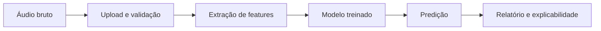
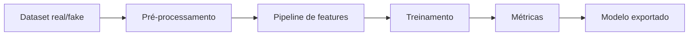
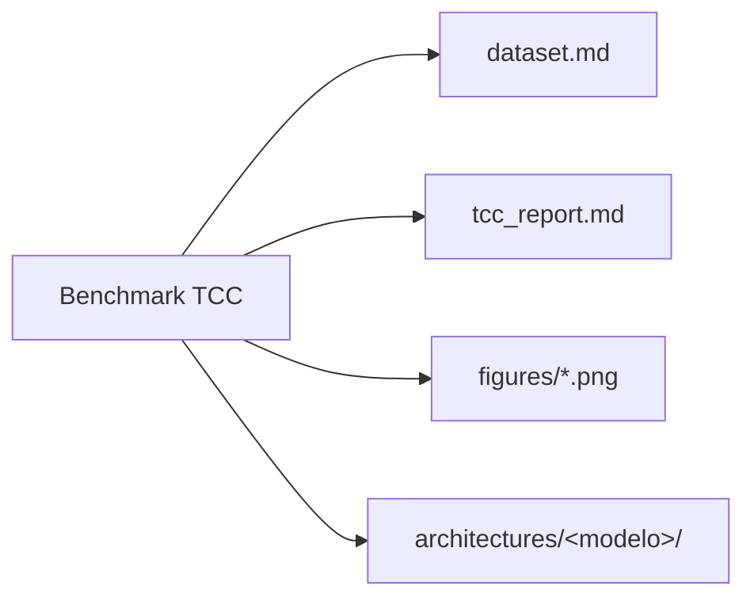

# Documentação do XFakeSong

O **XFakeSong** é uma plataforma open source para detecção de deepfakes de
áudio com execução local: interface Gradio, API FastAPI e pipelines modulares
de extração de features, treinamento, inferência e benchmark reprodutível para
o TCC.

Esta página é o mapa da documentação. As páginas detalhadas abaixo são as
fontes canônicas de cada assunto.

## Leitura por objetivo

| Se você quer… | Leia |
| --- | --- |
| Entender o escopo do projeto | [Introdução](01_INTRODUCAO.md) |
| Instalar e executar a aplicação | [Instalação e Configuração](02_INSTALACAO_CONFIGURACAO.md) |
| Navegar pela Clean Architecture | [Arquitetura](03_ARQUITETURA.md) |
| Trabalhar com extração de features | [Features de Áudio](04_FEATURES.md) |
| Contribuir com código | [Guia do Desenvolvedor](05_GUIA_DEV.md) |
| Validar qualidade e testes | [Testes e Qualidade](06_TESTES.md) |
| Integrar via HTTP | [API Reference](07_API_REFERENCE.md) |
| Comparar as arquiteturas neurais | [Arquiteturas Neurais](08_ARQUITETURAS.md) |
| Rodar predição com modelos treinados | [Inferência](09_INFERENCIA.md) |
| Treinar modelos | [Treinamento](10_TREINAMENTO.md) |
| Publicar no Hugging Face Spaces | [Deploy Hugging Face](11_DEPLOY_HUGGINGFACE.md) |
| Preparar datasets | [Datasets Públicos](12_DATASETS.md) |
| Executar no Google Colab | [Guia Google Colab](13_COLAB_GUIDE.md) |
| Auditar a aderência das arquiteturas | [Revisão das Arquiteturas](14_REVISAO_ARQUITETURAS.md) |
| Rodar o benchmark do TCC | [Benchmark e TCC](15_BENCHMARK.md) |
| Estudar com os notebooks | [Guia de Notebooks](16_NOTEBOOKS.md) |
| Entender CI/CD e segurança | [CI/CD e Segurança](17_CICD_SEGURANCA.md) |
| Consultar termos técnicos | [Glossário](18_GLOSSARIO.md) |

## Visão de uma página

- **14 arquiteturas** de detecção: 12 neurais (AASIST, RawGAT-ST, RawNet2,
  WavLM, HuBERT, Conformer, SpectrogramTransformer, Hybrid CNN-Transformer,
  EfficientNet-LSTM, MultiscaleCNN, Ensemble, Sonic Sleuth) + 2 clássicas
  (SVM, RandomForest).
- **Front-end real** por modelo: forma de onda bruta (raw-audio), log-mel ou
  **LFCC** (espectrograma), via `tf.signal` in-graph — paridade treino↔inferência
  garantida pelo `input_contract`.
- **Métricas** padrão da área: acurácia, AUC-ROC, **EER** e **min-tDCF**
  (ASVspoof), além de latência e tamanho do modelo.
- **Plataforma**: Python 3.13, TensorFlow/Keras 3, FastAPI + Gradio, Docker
  multi-stage, CI com testes/segurança/docs.

## Fluxos principais







## Comandos rápidos

```bash
python main.py --bootstrap-dirs                 # cria a estrutura de diretórios
python main.py --gradio                         # sobe a UI Gradio + API em :7860
./scripts/run_tests.sh fast                     # suíte rápida (sem smoke)
docker compose up --build -d                    # produção (Docker)
python scripts/run_tcc_pipeline.py --smoke --epochs 1 --batch-size 4
```

Para detalhes de ambiente, dependências e variáveis `.env`, veja
[Instalação e Configuração](02_INSTALACAO_CONFIGURACAO.md).
