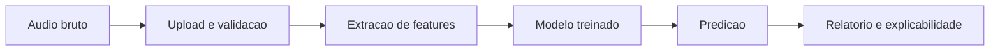
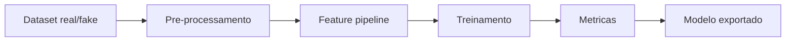
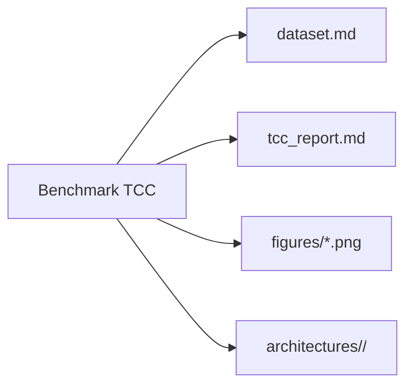

# XfakeSong Documentation

XfakeSong e uma plataforma open source para deteccao de deepfakes de audio com
execucao local, interface Gradio, API FastAPI e pipelines modulares de
extracao de features, treinamento e inferencia.

Esta pagina e o mapa da documentacao. As paginas detalhadas abaixo sao as
fontes canonicas para cada assunto.

## Leitura por Objetivo

| Se voce quer... | Leia |
| --- | --- |
| Instalar e executar a aplicacao | [Instalacao e Configuracao](02_INSTALACAO_CONFIGURACAO.md) |
| Entender o escopo do projeto | [Introducao](01_INTRODUCAO.md) |
| Navegar pela Clean Architecture | [Arquitetura](03_ARQUITETURA.md) |
| Trabalhar com extracao de features | [Features de Audio](04_FEATURES.md) |
| Contribuir com codigo | [Guia do Desenvolvedor](05_GUIA_DEV.md) |
| Validar qualidade e CI | [Testes e Qualidade](06_TESTES.md) |
| Integrar via HTTP | [API Reference](07_API_REFERENCE.md) |
| Comparar arquiteturas neurais | [Arquiteturas Neurais](08_ARQUITETURAS.md) |
| Rodar predicao com modelos treinados | [Inferencia](09_INFERENCIA.md) |
| Treinar modelos | [Treinamento](10_TREINAMENTO.md) |
| Publicar no Hugging Face Spaces | [Deploy Hugging Face](11_DEPLOY_HUGGINGFACE.md) |
| Preparar datasets | [Datasets Publicos](12_DATASETS.md) |
| Executar no Google Colab | [Guia Google Colab](13_COLAB_GUIDE.md) |
| Auditar aderencia das arquiteturas | [Revisao das Arquiteturas](14_REVISAO_ARQUITETURAS.md) |
| Rodar benchmark para TCC | [Benchmark e TCC](15_BENCHMARK.md) |
| Estudar com notebooks | [Guia de Notebooks](16_NOTEBOOKS.md) |

## Fluxos Principais







## Comandos Rapidos

```bash
python main.py --bootstrap-dirs
python main.py --gradio
./scripts/run_tests.sh fast
docker compose up --build -d
python scripts/run_tcc_pipeline.py --smoke --epochs 1 --batch-size 4
```

Para detalhes de ambiente, dependencias e variaveis `.env`, use
[Instalacao e Configuracao](02_INSTALACAO_CONFIGURACAO.md).
