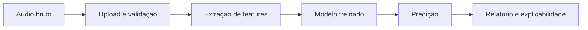
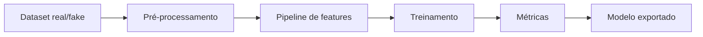
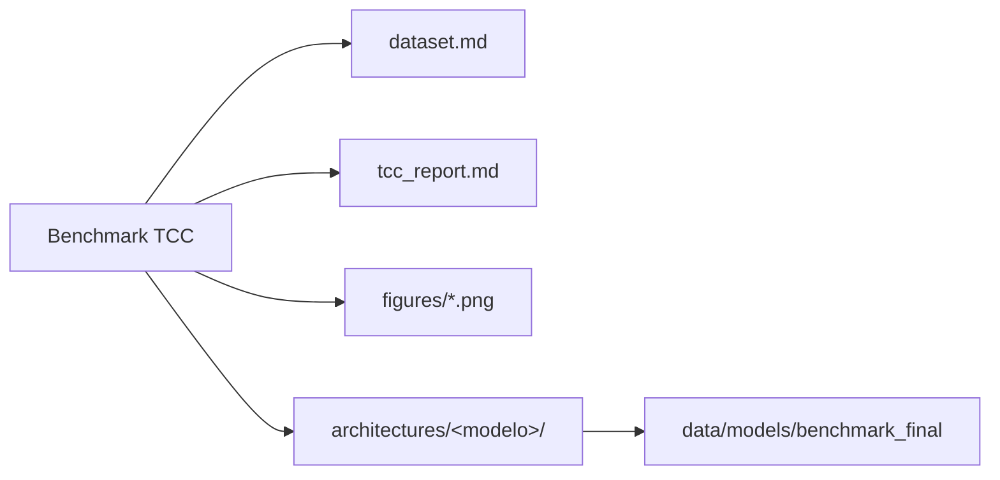

# Documentação do XFakeSong

O **XFakeSong** é uma plataforma open source para detecção de deepfakes de
áudio com execução local: interface Gradio, API FastAPI e pipelines modulares
de extração de features, treinamento, inferência e benchmark reprodutível para
o TCC.

Esta página é o mapa da documentação. As páginas detalhadas abaixo são as
fontes canônicas de cada assunto.

## Leitura por objetivo

| Se você quer… | Leia |
| --- | --- |
| Entender a área (anti-spoofing, ameaças, métricas) | [Conceitos e Fundamentos](getting-started/concepts.md) |
| Entender o escopo do projeto | [Introdução](getting-started/introduction.md) |
| Instalar e executar a aplicação | [Instalação e Configuração](getting-started/installation.md) |
| Navegar pela Clean Architecture | [Arquitetura](architecture/overview.md) |
| Trabalhar com extração de features | [Features de Áudio](architecture/audio-features.md) |
| Contribuir com código | [Guia do Desenvolvedor](development/developer-guide.md) |
| Planejar a separação de ambientes de treino | [Plano de Ambientes de Treinamento](archive/training-environments-plan.md) |
| Validar qualidade e testes | [Qualidade e Testes](development/quality-and-testing.md) |
| Integrar via HTTP e entender comunicação interna | [API REST e Comunicação](interfaces/rest-api.md) |
| Comparar as arquiteturas neurais | [Arquiteturas Neurais](models/architectures.md) |
| Rodar predição com modelos treinados | [Inferência](models/inference.md) |
| Treinar modelos | [Treinamento](models/training.md) |
| Usar a interface Gradio, suas abas e o serving de inferência | [Frontend Gradio](interfaces/gradio.md) |
| Publicar no Hugging Face Spaces | [Deploy Hugging Face](deployment/hugging-face-spaces.md) |
| Publicar documentação e demo | [GitHub Pages e Hugging Face](deployment/github-pages-and-hugging-face.md) |
| Preparar datasets | [Datasets Públicos](data/public-datasets.md) |
| Aplicar o protocolo acadêmico de dataset | [Protocolo de Dataset](data/dataset-protocol.md) |
| Executar no Google Colab | [Guia Google Colab](getting-started/google-colab.md) |
| Auditar a aderência das arquiteturas | [Revisão das Arquiteturas](models/literature-review.md) |
| Consultar a metodologia canônica da versão final | [Protocolo Final de ML](evaluation/final-ml-protocol.md) |
| Rodar o benchmark consolidado | [Benchmark e Resultados](evaluation/benchmark.md) |
| Consolidar ordem de execução e configs do pipeline de benchmark | [Auditoria do Pipeline de Benchmark](evaluation/pipeline-audit.md) |
| Rastrear ajustes de hiperparâmetros pós-diagnóstico e retreinos aplicados | [Retreino com Ajustes](evaluation/retraining-adjustments.md) |
| Acompanhar correções metodológicas do benchmark | [Plano de Correções do Benchmark](archive/benchmark-corrections-plan.md) |
| Retreinar com GPU via WSL2/Docker Desktop | [Retreino em WSL2](evaluation/retraining-wsl2.md) |
| Ler a fundamentação e análise experimental no GitHub Pages | [Estudo Experimental](evaluation/experimental-study.md) |
| Estudar com os notebooks | [Guia de Notebooks](evaluation/notebooks.md) |
| Entender CI/CD e segurança | [CI/CD e Segurança](development/ci-cd-and-security.md) |
| Consultar termos técnicos | [Glossário](reference/glossary.md) |
| Tirar dúvidas rápidas | [Perguntas Frequentes (FAQ)](reference/faq.md) |

## Artefatos consolidados

| Item | Local |
| --- | --- |
| Artigo (fonte LaTeX) | `data/results/paper/main.tex` |
| Tabelas geradas do benchmark | `data/results/paper/tabelas_benchmark.tex` |
| Dataset do benchmark atual | `data/datasets/benchmark_dataset.npz` — CETUC pareado com clones XTTS-v2, disjunção dupla locutor × frase, identidades publicadas (ver [Protocolo de Dataset](data/dataset-protocol.md)) |
| Modelos default da aplicação | [`data/models`](https://github.com/thierrybraga/XFakeSong/tree/main/data/models) |
| Modelos completos por arquitetura | [`data/models/benchmark_final`](https://github.com/thierrybraga/XFakeSong/tree/main/data/models/benchmark_final) |
| Métricas, gráficos e relatórios | [`results`](https://github.com/thierrybraga/XFakeSong/tree/main/results) |

## Estudo experimental no GitHub Pages

A documentação agora incorpora a fundamentação técnica e a análise experimental
consolidadas a partir do trabalho:

- equações de síntese, pré-processamento, VAD e extração de características em
  [Features de Áudio](architecture/audio-features.md) e [Estudo Experimental](evaluation/experimental-study.md);
- fluxograma de predição e treinamento em [Arquitetura](architecture/overview.md);
- descrição das 14 arquiteturas e decisão operacional em
  [Arquiteturas Neurais](models/architectures.md);
- resultados, artefatos, modelos treinados e rastreabilidade em
  [Benchmark e Resultados](evaluation/benchmark.md);
- uso da interface, abas, notificações e fluxos de análise em
  [Frontend Gradio](interfaces/gradio.md);
- publicação coordenada de documentação e demonstração em
  [GitHub Pages e Hugging Face](deployment/github-pages-and-hugging-face.md);
- plano de separação de ambientes Docker e dependências por família em
  [Plano de Ambientes de Treinamento](archive/training-environments-plan.md);
- versão navegável do estudo em
  [Estudo Experimental](evaluation/experimental-study.md).

## Visão de uma página

- **14 arquiteturas** de detecção: 12 neurais (AASIST, RawGAT-ST, RawNet2,
  WavLM, HuBERT, Conformer, SpectrogramTransformer, Hybrid CNN-Transformer,
  EfficientNet-LSTM, MultiscaleCNN, Ensemble, Sonic Sleuth) + 2 clássicas
  (SVM, RandomForest). O benchmark as cobre em **11 entradas** no escopo
  oficial e 5 no estendido — WavLM e HuBERT aparecem como `Original`
  (backbone congelado, cabeça treinada: a configuração documentada) no oficial
  e em porte Keras no estendido.
- **Front-end real** por modelo: forma de onda bruta (raw-audio), log-mel ou
  **LFCC** (espectrograma), via `tf.signal` in-graph — paridade treino↔inferência
  garantida pelo `input_contract`.
- **Métricas** padrão da área: acurácia, AUC-ROC, **EER** e **min-tDCF**
  (ASVspoof), além de latência e tamanho do modelo.
- **Plataforma**: Python 3.11, TensorFlow/Keras 3, FastAPI + Gradio, Docker
  multi-stage, CI com testes/segurança/docs.

## Fluxos principais


```mermaid
flowchart LR
    A["Áudio bruto"] --> B["Upload e validação"]
    B --> C["Extração de features"]
    C --> D["Modelo treinado"]
    D --> E["Predição"]
    E --> F["Relatório e explicabilidade"]
```


```mermaid
flowchart LR
    A["Dataset real/fake"] --> B["Pré-processamento"]
    B --> C["Pipeline de features"]
    C --> D["Treinamento"]
    D --> E["Métricas"]
    E --> F["Modelo exportado"]
```


```mermaid
flowchart LR
    A["Benchmark TCC"] --> B["dataset.md"]
    A --> C["tcc_report.md"]
    A --> D["figures/*.png"]
    A --> E["architectures/&lt;modelo&gt;/"]
    E --> F["data/models/benchmark_final"]
```

## Comandos rápidos

```bash
python main.py --bootstrap-dirs                 # cria a estrutura de diretórios
python main.py --gradio                         # sobe a UI Gradio + API em :7860
./scripts/ops/run_tests.sh fast                     # suíte rápida (sem smoke)
docker compose up --build -d                    # produção (Docker)
python scripts/benchmark/run_tcc_pipeline.py --smoke --epochs 1 --batch-size 4
```

Para detalhes de ambiente, dependências e variáveis `.env`, veja
[Instalação e Configuração](getting-started/installation.md).
