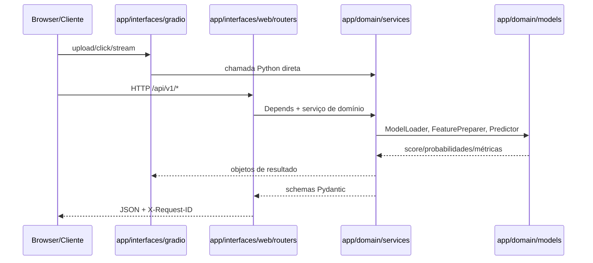

# 07 — API REST e Comunicação

Esta é a referência canônica para integrar o XFakeSong via HTTP e entender como
a interface Gradio conversa com o backend. A API é servida por FastAPI no mesmo
processo que monta a UI.

## Endereços

Comando local padrão:

```bash
python main.py --gradio
```

| Recurso | URL |
|---|---|
| Página inicial | `http://localhost:7860/` |
| Interface Gradio | `http://localhost:7860/gradio` |
| API REST | `http://localhost:7860/api/v1` |
| Swagger UI | `http://localhost:7860/api/docs` |
| ReDoc | `http://localhost:7860/api/redoc` |
| OpenAPI Schema | `http://localhost:7860/api/openapi.json` |

`app/interfaces/gradio/app.py` é o entry point unificado usado por
`python main.py --gradio`. `app/interfaces/web/main_fastapi.py` também monta
FastAPI, `StaticFiles`, templates Jinja2 e, fora de pytest/modo API-only, a UI
Gradio em `/gradio`.

Para subir só a API sem montar Gradio, use `XFAKE_API_ONLY=true` ou
`XFAKE_SKIP_GRADIO=true`.

## Fluxo de Comunicação



Regras de acoplamento:

- `app/domain/` não importa FastAPI, Gradio nem routers.
- Gradio chama serviços de domínio diretamente quando a ação é local/interativa.
- A API expõe os mesmos serviços via `TestClient`/HTTP, com schemas em
  `app/interfaces/web/schemas/api_models.py`.
- Dependências compartilhadas saem de `app/dependencies.py`, que usa singletons
  cacheados.

## Contratos Transversais

### Autenticação

Endpoints de mutação ou custo alto usam API Key — mas os routers de
`datasets`, `history` e `voice_profiles` aplicam `Depends(get_api_key)` no
**router inteiro**, então todas as rotas desses três (inclusive `GET`
somente-leitura) também exigem a chave, não só as de escrita:

```http
X-API-Key: <sua_chave>
```

Configure com `XFAKESONG_API_KEY`. Em desenvolvimento, se a variável estiver
ausente, o acesso pode ser permitido com aviso em log.

### Rate limiting

As rotas usam limites por IP via `slowapi`. Exemplos: `10/minute` em análise de
áudio, `5/minute` em fusão multi-modelo e `3/minute` em cross-validation.
Excesso retorna HTTP 429.

### Rastreamento

O middleware adiciona `X-Request-ID` nas respostas. Clientes podem enviar o
mesmo header para correlacionar logs, UI e chamadas HTTP.

### Erros

Erros seguem RFC 7807 Problem Details:

```json
{
  "type": "about:blank",
  "title": "Validation Error",
  "status": 400,
  "detail": "Mensagem específica",
  "error_code": "VALIDATION_ERROR",
  "request_id": "abc123",
  "errors": [{"field": "x", "message": "..."}]
}
```

## System (`/api/v1/system`)

| Método | Path | Descrição |
|---|---|---|
| GET | `/status` | Status operacional e serviços ativos |
| GET | `/health` | DB, modelos carregados, storage e uptime |
| GET | `/bootstrap` | Endpoint mínimo de bootstrap |
| GET | `/feedback` | Eventos recentes usados por terminal, API e UI |
| POST | `/feedback/read` | Marca feedback em memória como lido |
| POST | `/feedback/clear` | Limpa histórico de feedback em memória |
| GET | `/version` | Versões de app, Python, TF/Keras, Gradio, sklearn, git SHA e plataforma |
| GET | `/info` | Snapshot consolidado para dashboard/monitoramento |

Use `/health` em deploy e `/info` quando quiser reduzir polling do dashboard a
uma única chamada.

## Detection (`/api/v1/detection`)

### `POST /analyze`

Detecta deepfake em um arquivo de áudio.

Form-data:

| Campo | Tipo | Obrigatório | Descrição |
|---|---|---:|---|
| `file` | UploadFile | sim | `.wav`, `.mp3`, `.flac`, `.m4a` ou `.ogg` |
| `model_name` | string | não | nome de modelo treinado específico |
| `architecture` | string | não | arquitetura para auto-find |
| `variant` | string | não | variante da arquitetura |
| `normalize` | bool | não | default `true` |
| `segmented` | bool | não | inferência em janelas para áudios longos |

Resposta 200 (`PredictionResult`):

```json
{
  "is_fake": true,
  "confidence": 0.92,
  "probabilities": {"real": 0.08, "fake": 0.92},
  "model_name": "AASIST_v1",
  "features_used": ["mel_spectrogram"],
  "metadata": {},
  "temperature_applied": 1.42,
  "ood_score": 0.55,
  "is_ood": false,
  "ood_threshold": 0.2,
  "classification_threshold": 0.48
}
```

### `POST /multi-model`

Executa fusão de múltiplos modelos.

Form-data:

| Campo | Tipo | Obrigatório | Descrição |
|---|---|---:|---|
| `file` | UploadFile | sim | áudio suportado |
| `model_names` | JSON string | sim | `["AASIST_v1", "Conformer_v1"]`, mínimo 2 |
| `fusion` | string | não | `weighted_avg`, `soft_voting`, `majority_vote` ou `max_conf` |
| `weights` | JSON string | não | pesos como `[0.4, 0.6]` |
| `use_tta` | bool | não | ativa TTA por modelo |

### `POST /uncertainty`

Predição com MC Dropout.

Form-data:

| Campo | Tipo | Obrigatório | Descrição |
|---|---|---:|---|
| `file` | UploadFile | sim | áudio suportado |
| `model_name` | string | não | usa default se omitido |
| `n_samples` | int | não | 5 a 200, default 20 |

Use `is_uncertain=true` para uma decisão de abstenção quando o modelo estiver
hesitante.

### Descoberta

| Método | Path | Descrição |
|---|---|---|
| GET | `/models` | modelos disponíveis, default e carregados |
| GET | `/architectures` | arquiteturas suportadas |

## Features (`/api/v1/features`)

| Método | Path | Descrição |
|---|---|---|
| POST | `/extract` | extrai features de um áudio |
| GET | `/types` | lista tipos de features disponíveis |

`POST /extract` recebe `file`, `feature_types` como JSON string e `normalize`.
Os tipos aceitos incluem `spectral`, `cepstral`, `temporal`, `prosodic`,
`voice_quality`, `mel_spectrogram` e outros registrados no domínio.

## Training (`/api/v1/training`)

### `POST /start`

Inicia job de treinamento em background. Requer API Key.

```json
{
  "architecture": "aasist",
  "dataset_path": "data/train.npz",
  "model_name": "aasist_v1",
  "epochs": 50,
  "batch_size": 16,
  "learning_rate": 0.0008,
  "parameters": {"dropout_rate": 0.2}
}
```

Resposta: `TrainingResponse` com `job_id`, `status`, `message` e `progress`.
Falha ao criar job retorna HTTP 503.

### Rotas de treino

| Método | Path | API Key | Descrição |
|---|---|---:|---|
| GET | `/status/{job_id}` | não | status atual do job |
| GET | `/architectures` | não | arquiteturas treináveis |
| POST | `/cross-validate` | sim | inicia K-fold cross-validation |
| GET | `/cross-validate/{job_id}` | não | resultado final da CV concluída |
| POST | `/export-onnx` | sim | exporta modelo TensorFlow/Keras carregado para ONNX e, opcionalmente, INT8 |

`/cross-validate/{job_id}` só retorna resultado quando o job está `completed`.
Para progresso intermediário, consulte `/status/{job_id}`.

## History (`/api/v1/history`)

Router inteiro atrás de API Key (`dependencies=[Depends(get_api_key)]`),
inclusive as leituras.

| Método | Path | API Key | Descrição |
|---|---|---:|---|
| GET | `/` | sim | histórico paginado de análises |
| GET | `/{analysis_id}` | sim | detalhe de uma análise |
| DELETE | `/{analysis_id}` | sim | exclui uma análise |

## Datasets (`/api/v1/datasets`)

Router inteiro atrás de API Key, inclusive `GET /`.

| Método | Path | API Key | Descrição |
|---|---|---:|---|
| GET | `/` | sim | lista datasets, com filtro `type` |
| POST | `/` | sim | cria dataset vazio |
| POST | `/{name}/upload` | sim | upload de arquivo para dataset |
| DELETE | `/{name}` | sim | remove dataset |

## Voice Profiles (`/api/v1/profiles`)

Router inteiro atrás de API Key, inclusive as leituras (`GET /`,
`GET /{id}`) — apesar da regra geral de "mutação ou custo alto" na seção de
Autenticação acima, aqui a chave é exigida em todas as 9 rotas.

| Método | Path | API Key | Descrição |
|---|---|---:|---|
| GET | `/` | sim | lista perfis |
| POST | `/` | sim | cria perfil |
| GET | `/{id}` | sim | detalhes |
| PUT | `/{id}` | sim | atualiza |
| DELETE | `/{id}` | sim | remove |
| POST | `/{id}/samples` | sim | upload de amostras |
| DELETE | `/{id}/samples/{filename}` | sim | remove amostra |
| POST | `/{id}/train` | sim | treina modelo do perfil |
| POST | `/{id}/detect` | sim | verifica se áudio pertence ao perfil |

## Validação Local

```bash
./scripts/ops/run_tests.sh api
./scripts/ops/run_tests.sh functional
```

Cobertura relevante:

- `tests/api/test_smoke.py` valida rotas esperadas, OpenAPI, endpoints triviais
  e compatibilidade de schemas.
- `tests/api/test_detection.py`, `test_features.py`, `test_training.py` e
  `test_datasets.py` cobrem contratos por área.
- `tests/functional/test_frontend_routes.py` valida o bootstrap consumido pela
  superfície de frontend.
- `tests/integration/test_domain_imports_without_web_layer.py` protege o
  desacoplamento entre domínio e web layer.
